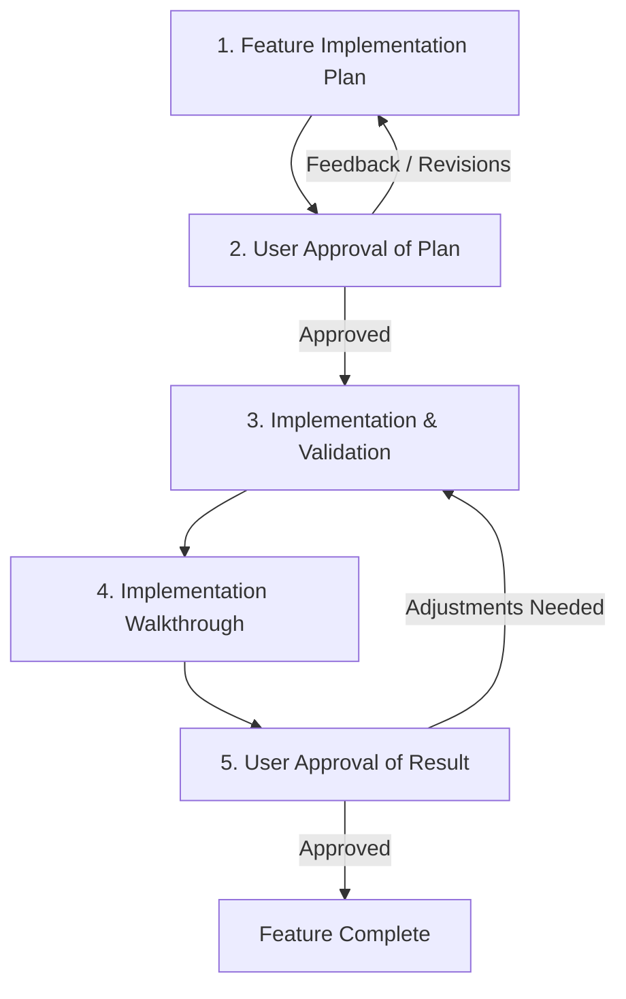

# Feature Implementation Workflow

This skill defines the required 5-stage lifecycle for designing, approving, implementing, validating, and reviewing features in this repository.

## Workflow Overview



---

## Stage 1: Feature Implementation Plan

Before modifying any source code or writing implementation files:

1. **Determine Feature Identifier**:
   - Establish a clean, lowercase kebab-case slug for the feature or issue: `<feature_name_or_id>` (e.g. `user-auth`, `game-history-indexer`, `issue-42`).
2. **Deep Research**:
   - Inspect existing agent definitions (`src/`), schemas, and Effect patterns.
   - Inspect `golem.yaml` component and deployment configurations.
   - Inspect relevant domain skills (e.g., `golem-add-agent-effect`, `golem-build`, `golem-add-postgres-effect`).
   - Identify any missing dependencies or environmental requirements.
3. **Draft the Plan**:
   - Ensure the directory `docs/implementation/` exists.
   - Write the plan to:
     ```text
     docs/implementation/<feature_name_or_id>_feature_plan.md
     ```
   - Reference [feature_plan_template.md](./resources/feature_plan_template.md) for structure.
   - The plan MUST include:
     - **Overview & Goals**: What the feature accomplishes and why.
     - **Architecture & Design**: Agent interfaces, Effect schemas, services, storage, and concurrency model.
     - **File-by-File Changes**: Categorized with `[NEW]`, `[MODIFY]`, or `[DELETE]`.
     - **Verification Plan**: Exact commands to run for typecheck, build, automated tests, and runtime checks.
     - **Risks & Open Questions**: Known trade-offs or technical decisions.

---

## Stage 2: User Approval of Plan (Gate 1)

**DO NOT proceed with code implementation until explicit user approval is received.**

1. Present a concise summary of the proposed plan in the chat.
2. Provide a direct link to the plan file:
   - `[Feature Plan](docs/implementation/<feature_name_or_id>_feature_plan.md)`
3. Ask the user for review and approval:
   > "Please review the implementation plan. If everything looks good, please approve to proceed with implementation, or let me know what you would like to adjust."
4. If the user provides feedback or requests changes:
   - Update `docs/implementation/<feature_name_or_id>_feature_plan.md`.
   - Re-request approval until confirmed.

---

## Stage 3: Implementation & Validation

Once user approval is granted:

1. **Implement Changes**:
   - Execute the changes incrementally, following the approved plan.
   - Ensure all new agent definitions and methods follow Golem Effect SDK conventions.
   - Maintain clean modularity, schema validation, and typed error handling.
2. **Run Rigorous Validation**:
   - **Code Formatting**:
     ```bash
     npm run format:check # npx prettier --check src/ test/
     ```
     Verify that all source and test files comply with formatting standards. Use `npm run format` (`prettier --write src/ test/`) to auto-format.
   - **Type Checking**:
     ```bash
     npm run typecheck   # npx tsc --noEmit
     ```
     Verify that there are zero TypeScript compiler errors.
   - **Linter Verification**:
     ```bash
     npm run lint        # npx eslint src/ test/
     ```
     Verify that there are zero lint errors and zero unused symbols/imports.
   - **Golem Build**:
     ```bash
     npm run build       # golem build --yes
     ```
     Verify that the WASM component bundle builds cleanly.
   - **Automated Tests**:
     ```bash
     npm test            # npx tsx --test
     ```
     Execute automated unit and integration tests.
   - **Runtime / Smoke Verification**:
     Where applicable, verify agent interactions or use the Golem CLI / REPL to ensure proper behavior.
3. **Fix Any Regressions**:
   - If any validation check fails, diagnose and resolve the issue immediately before moving forward.

---

## Stage 4: Implementation Walkthrough

Once implementation and all validation checks pass:

1. Create the walkthrough document at:
   ```text
   docs/implementation/<feature_name_or_id>_implementation_walkthrough.md
   ```
2. Reference [walkthrough_template.md](./resources/walkthrough_template.md) for structure.
3. The walkthrough MUST document:
   - **Executive Summary**: High-level outcome of the implementation.
   - **Changes Implemented**: Detailed list of modified/created files with clickable file links.
   - **Validation Results**: Actual output or proof of success for:
     - Typecheck: `npm run typecheck` (`npx tsc --noEmit`)
     - Linter: `npm run lint` (`npx eslint src/ test/`)
     - Build: `npm run build` (`golem build --yes`)
     - Tests: `npm test`
     - Runtime smoke verification
   - **Verification / Usage Guide**: Step-by-step instructions for how the user can test or interact with the feature.

---

## Stage 5: User Approval of Result (Gate 2)

1. Present the completed results to the user in chat.
2. Provide a direct link to the walkthrough:
   - `[Implementation Walkthrough](docs/implementation/<feature_name_or_id>_implementation_walkthrough.md)`
3. Summarize key validation findings and ask for final sign-off:
   > "Implementation and validation are complete. Please review the walkthrough and let me know if you approve or if any further adjustments are needed."
