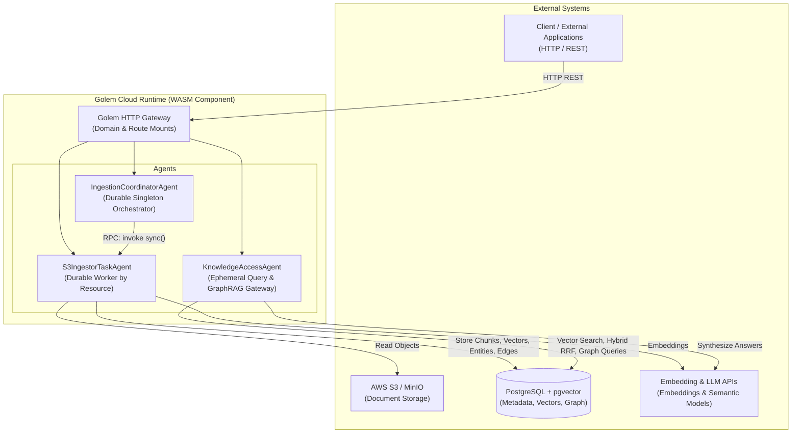

# Golem Knowledge Graph Service (golem-kgs-effect)

A durable, serverless Knowledge Graph and GraphRAG service built on [Golem Cloud](https://learn.golem.cloud) with TypeScript and [Effect](https://effect.website). It provides incremental document ingestion, semantic chunking, vector embeddings, entity/relation extraction, graph traversal, and hybrid search.

---

## Architecture



### External Systems

| System | Role |
| :--- | :--- |
| **Golem Cloud Runtime** | WebAssembly host providing durable execution, automatic state recovery, transactional retry, and native HTTP routing. |
| **PostgreSQL + pgvector** | Primary persistent store for raw documents, text chunks, vector embeddings, entities, graph edges, and sync checkpoints (`@golemcloud/effect-golem/postgres`). |
| **AWS S3 / S3-Compatible Storage** | Source document repositories (e.g. MinIO, AWS S3) scanned incrementally using ETag and timestamp checkpoints. |
| **Embedding & LLM Providers** | Vector embedding generation and semantic question-answering capabilities. |

---

## Agents & Core Functions

### 1. `IngestionCoordinatorAgent` (Singleton)
Central coordinator managing sync schedules, webhook ingress, and dispatching tasks to worker agents.
- **`triggerSync(resourceName)`** (`POST /api/coordinator/sync`): Manually triggers an ingestion run for a named S3 target.
- **`handleWebhook(sourceType, resourceName, payload)`** (`POST /api/coordinator/webhook/{sourceType}/{resourceName}`): Receives external push events (e.g. S3 bucket notifications) to schedule syncs.
- **`registerSchedule(resourceName, cronExpr)`** (`POST /api/coordinator/schedules`): Registers or updates recurring sync intervals.
- **`getStatus()`** (`GET /api/coordinator/status`): Inspects coordinator state, active schedules, and sync history.

### 2. `S3IngestorTaskAgent` (Parameterized by Resource)
Dedicated ingestion worker executing the ETL pipeline for a specific storage target (`main`, `legal`, `technical`).
- **`sync()`** (`POST /api/ingestion/{resourceName}/sync`): Discovers changed files in S3, parses Markdown, extracts headings/breadcrumbs, generates embeddings, extracts entity/relation triples, and commits to PostgreSQL.
- **`processBatch(documents)`**: Internal pipeline processing chunks, vector embeddings, entity resolution, and graph edge creation.
- **`batchCallback(result)`** (`POST /api/ingestion/{resourceName}/batch-callback`): Webhook receiver for asynchronous external processing jobs.

### 3. `KnowledgeAccessAgent` (Ephemeral / Stateless)
Read-only query and retrieval interface exposing GraphRAG search and graph traversal endpoints. Configured with `mode: "ephemeral"` so invocations do not replay or persist state, maximizing throughput for concurrent queries.
- **`search(query, limit)`** (`POST /api/knowledge/search`): Hybrid search combining dense vector similarity and full-text keyword search via Reciprocal Rank Fusion (RRF).
- **`ask(question)`** (`POST /api/knowledge/ask`): GraphRAG question-answering retrieving relevant context chunks, related graph entities, and synthesizing an answer.
- **`getEntity(id)`** (`GET /api/knowledge/entities/{id}`): Fetches entity metadata, attributes, and known aliases.
- **`getDocument(id)`** (`GET /api/knowledge/documents/{id}`): Retrieves raw document content, title, source URI, and metadata.
- **`getNeighborhood(entityId, hops)`** (`POST /api/knowledge/neighborhood`): Traverses entity graph relationships up to $N$ hops.
- **`findPaths(sourceId, targetId, maxHops)`** (`POST /api/knowledge/paths`): Computes graph paths connecting two entities.
- **`getOverview()`** (`GET /api/knowledge/overview`): Returns knowledge base metrics (counts of documents, chunks, entities, edges, and latest sync timestamp).

---

## HTTP Endpoints Quick Reference

| Agent | Method | Route | Description |
| :--- | :--- | :--- | :--- |
| **Knowledge** | `GET` | `/api/knowledge/overview` | Knowledge base statistics |
| **Knowledge** | `GET` | `/api/knowledge/entities/{id}` | Entity lookup |
| **Knowledge** | `GET` | `/api/knowledge/documents/{id}` | Raw document lookup |
| **Knowledge** | `POST` | `/api/knowledge/search` | Hybrid RRF search |
| **Knowledge** | `POST` | `/api/knowledge/ask` | GraphRAG question answering |
| **Knowledge** | `POST` | `/api/knowledge/neighborhood` | Entity neighborhood graph traversal |
| **Knowledge** | `POST` | `/api/knowledge/paths` | Entity path finding |
| **Coordinator** | `GET` | `/api/coordinator/status` | Coordinator status and schedules |
| **Coordinator** | `POST` | `/api/coordinator/sync` | Trigger sync run |
| **Coordinator** | `POST` | `/api/coordinator/schedules` | Set cron schedule |
| **Coordinator** | `POST` | `/api/coordinator/webhook/{sourceType}/{resourceName}` | Webhook ingress |
| **Ingestor** | `POST` | `/api/ingestion/{resourceName}/sync` | Direct S3 resource sync |
| **Ingestor** | `POST` | `/api/ingestion/{resourceName}/batch-callback` | Batch job callback |

---

## Extraction Rules Configuration

Knowledge extraction rules (term dictionaries, relation patterns, and proper-noun stopwords) are fully configurable via [`AppAgentConfig`](file:///Users/coon/workspace-zv/git/golem-kgs-effect/src/config/agent-config.ts) and `golem.yaml`, allowing custom domain adaptations (e.g. legal, financial, or medical) without code changes:

```yaml
components:
  golem-kgs-effect:effect-main:
    config:
      extraction:
        dictionary:
          gdpr: "General Data Protection Regulation"
          ccpa: "California Consumer Privacy Act"
        relationPatterns:
          - relation: "GOVERNED_BY"
            phrases: ["governed by", "subject to", "pursuant to"]
            confidence: 0.9
        stopwords:
          - "Legal Notice"
          - "Article"
```

---

## Development & Build

```bash
# Install dependencies
npm install

# Run typecheck and linting
npm run typecheck
npm run lint

# Run unit and integration tests
npm test

# Build Golem WebAssembly component
golem build --yes
```
