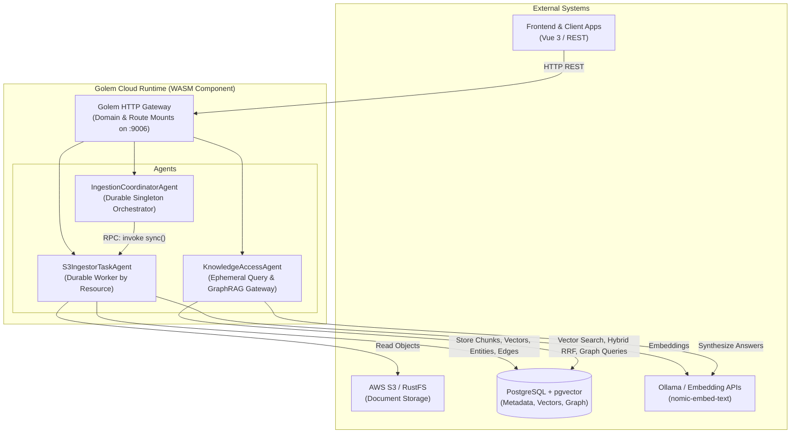

# Golem Knowledge Graph Service (golem-kgs-effect)

A durable, serverless Knowledge Graph and GraphRAG service built on [Golem Cloud](https://learn.golem.cloud) with TypeScript and [Effect](https://effect.website). It provides incremental document ingestion, semantic chunking, vector embeddings, entity/relation extraction, graph traversal, and hybrid search.

---

## Architecture



### Core Architecture Components

| System | Role |
| :--- | :--- |
| **Golem Cloud Runtime** | WebAssembly host providing durable execution, automatic state recovery, transactional retry, and native HTTP routing. |
| **PostgreSQL + pgvector** | Persistent store for raw documents, text chunks, vector embeddings, entities, graph edges, and sync checkpoints (`@golemcloud/effect-golem/postgres`). |
| **S3 Storage (RustFS / AWS S3)** | Source document repositories scanned incrementally using ETag and timestamp checkpoints with AWS SigV4 authorization. |
| **Ollama Embeddings** | Generates 768-dimensional dense vector embeddings (`nomic-embed-text`) via OpenAI-compatible endpoints. |

---

## Agents & Core Functions

### 1. `IngestionCoordinatorAgent` (Singleton)
Central supervisor managing sync schedules, webhook ingress, and dispatching tasks to worker agents.
- **`POST /api/coordinator/sync`**: Triggers a manual sync run for a named S3 target.
- **`POST /api/coordinator/schedules`**: Registers or updates recurring cron sync schedules.
- **`GET /api/coordinator/status`**: Inspects coordinator state, active schedules, and sync history.
- **`POST /api/coordinator/webhook/{sourceType}/{resourceName}`**: Receives external push notifications.

### 2. `S3IngestorTaskAgent` (Parameterized by Resource)
Dedicated worker agent executing the ETL pipeline for a specific storage target (`main`, `legal`, `technical`).
- **`POST /api/ingestion/{resourceName}/sync`**: Discovers changed files in S3, parses Markdown, extracts headings/breadcrumbs, generates embeddings, extracts entity/relation triples, and commits to PostgreSQL.
- **`GET /api/ingestion/{resourceName}/status`**: Returns current sync metrics, processed ETags, and timestamps.
- **`POST /api/ingestion/{resourceName}/reset`**: Clears sync cursor to force a full re-index.
- **`POST /api/ingestion/{resourceName}/batch-callback`**: Webhook receiver for asynchronous external batch jobs.

### 3. `KnowledgeAccessAgent` (Ephemeral / Stateless)
High-throughput query and retrieval interface exposing GraphRAG search, entity resolution, and graph traversal endpoints. Configured with `mode: "ephemeral"` for high concurrency.
- **`POST /api/knowledge/ask`**: GraphRAG question-answering with hybrid retrieval, multi-hop entity graph traversal, and answer synthesis with citations.
- **`POST /api/knowledge/search`**: Hybrid search combining pgvector cosine distance and full-text search fused via Reciprocal Rank Fusion (RRF, $k=60$).
- **`POST /api/knowledge/entities/search`**: Entity search and autocomplete by prefix, name, alias, or keyword. Automatically returns top connected graph hubs when `query` is empty or omitted.
- **`POST /api/knowledge/entities/top`**: Retrieves top connected entities (graph hubs) sorted by degree (relationship count) and freshness.
- **`POST /api/knowledge/neighborhood`**: Multi-hop topological graph traversal around seed entities. Supports human entity names (e.g. `"PostgreSQL"`), aliases (e.g. `"postgres"`), or IDs with transparent resolution, returning complete entity records without data redundancy.
- **`POST /api/knowledge/paths`**: Relational shortest-path search between two entities. Supports natural entity names or IDs with transparent resolution and returns populated entity lookup pools.
- **`GET /api/knowledge/overview`**: Summary counts (documents, chunks, entities, relationships, last sync).
- **`GET /api/knowledge/entities/{id}`**: Entity metadata, attributes, and known aliases.
- **`GET /api/knowledge/documents/{id}`**: Raw document content, title, and metadata.

---

## HTTP Endpoints Quick Reference

| Agent | Method | Route | Description |
| :--- | :--- | :--- | :--- |
| **Knowledge** | `GET` | `/api/knowledge/overview` | Knowledge base statistics |
| **Knowledge** | `GET` | `/api/knowledge/entities/{id}` | Entity lookup by ID |
| **Knowledge** | `GET` | `/api/knowledge/documents/{id}` | Document lookup by ID |
| **Knowledge** | `POST` | `/api/knowledge/entities/search` | Entity autocomplete / search by prefix, name, or alias |
| **Knowledge** | `POST` | `/api/knowledge/entities/top` | Top connected entities (graph hubs) sorted by degree |
| **Knowledge** | `POST` | `/api/knowledge/search` | Hybrid RRF vector + keyword search |
| **Knowledge** | `POST` | `/api/knowledge/ask` | GraphRAG question answering |
| **Knowledge** | `POST` | `/api/knowledge/neighborhood` | Entity neighborhood graph traversal (accepts names or IDs) |
| **Knowledge** | `POST` | `/api/knowledge/paths` | Multi-hop path finding between entities (accepts names or IDs) |
| **Coordinator** | `GET` | `/api/coordinator/status` | Coordinator status and active schedules |
| **Coordinator** | `POST` | `/api/coordinator/sync` | Trigger sync run |
| **Coordinator** | `POST` | `/api/coordinator/schedules` | Set recurring cron schedule |
| **Coordinator** | `POST` | `/api/coordinator/webhook/{sourceType}/{resourceName}` | Webhook ingress |
| **Ingestor** | `GET` | `/api/ingestion/{resourceName}/status` | Ingestor status and checkpoint |
| **Ingestor** | `POST` | `/api/ingestion/{resourceName}/sync` | Trigger S3 resource sync |
| **Ingestor** | `POST` | `/api/ingestion/{resourceName}/reset` | Reset cursor for full rescan |
| **Ingestor** | `POST` | `/api/ingestion/{resourceName}/batch-callback` | External batch job callback |

---

## Configuration (`golem.yaml`)

Both S3 storage targets and extraction rules use clean, typed lists of named objects:

### 1. S3 Storage Resources
Configured under `secretDefaults.local.resources.s3`:

```yaml
secretDefaults:
  local:
    resources:
      s3:
        - name: "main"
          endpoint: "{{ S3_ENDPOINT_URL }}"
          region: "{{ AWS_DEFAULT_REGION }}"
          bucket: "golem-documents"
          prefixes:
            - "general/"
          accessKeyId: "{{ AWS_ACCESS_KEY_ID }}"
          secretAccessKey: "{{ AWS_SECRET_ACCESS_KEY }}"
```

### 2. Entity & Relation Extraction Rules
Configured under `components.golem-kgs-effect:effect-main.config.extraction`:

```yaml
components:
  golem-kgs-effect:effect-main:
    config:
      extraction:
        dictionary:
          - alias: "golem"
            canonical: "Golem Cloud"
          - alias: "effect"
            canonical: "Effect-TS"
          - alias: "postgresql"
            canonical: "PostgreSQL"
          - alias: "pgvector"
            canonical: "pgvector"
        relationPatterns:
          - relation: "DEPENDS_ON"
            confidence: 0.85
            phrases:
              - "depends on"
              - "requires"
              - "relies on"
          - relation: "AUTHORED_BY"
            confidence: 0.90
            phrases:
              - "authored by"
              - "created by"
        stopwords:
          - "Table Of"
          - "The Following"
          - "For Example"
```

---

## Getting Started

### Prerequisites
- Node.js >= 20
- Docker Desktop
- [Golem CLI](https://learn.golem.cloud/install) >= 1.5.0
- Ollama with `nomic-embed-text`:
  ```bash
  ollama pull nomic-embed-text
  ```

### 1. Start Infrastructure
Start PostgreSQL with pgvector and RustFS (S3 storage):
```bash
docker compose up -d
```

### 2. Configure Environment
Copy and inspect `.env`:
```bash
cp .env.example .env
```
Ensure endpoints point to `127.0.0.1` on macOS to avoid IPv6 resolution issues:
```env
POSTGRES_HOST=127.0.0.1
POSTGRES_PORT=5432
S3_ENDPOINT_URL=http://127.0.0.1:9000
EMBEDDING_API_BASE=http://127.0.0.1:11434/v1
EMBEDDING_MODEL=nomic-embed-text
```

### 3. Build and Deploy
```bash
# Install dependencies & run tests
npm install
npm test

# Deploy to local Golem cluster
set -a && source .env && set +a
golem deploy --redeploy-agents --yes
```

The Golem HTTP Gateway will be active on **`http://localhost:9006`**.

### 4. Start Frontend
A Vue 3 + Vite visual explorer is available in `frontend/`:
```bash
cd frontend
npm install
npm run dev
```
Open **`http://localhost:5173`** to interact with the Knowledge Graph, Search, and Ask views.

---

## Example Usage

### Synchronize S3 Documents
```bash
curl -X POST 'http://localhost:9006/api/ingestion/main/sync' \
  -H 'Content-Type: application/json' \
  -d '{"force": false}'
```

### GraphRAG Question Answering
```bash
curl -s --url 'http://localhost:9006/api/knowledge/ask' \
  -H 'Content-Type: application/json' \
  -d '{
    "query": "What is Golem Cloud and how does it achieve durable execution?",
    "topK": 5,
    "maxHops": 2,
    "generateAnswer": true
  }'
```

### Hybrid Search
```bash
curl -s --url 'http://localhost:9006/api/knowledge/search' \
  -H 'Content-Type: application/json' \
  -d '{
    "query": "database optimization",
    "limit": 5,
    "searchType": "hybrid"
  }'
```

### Knowledge Base Overview
```bash
curl -s http://localhost:9006/api/knowledge/overview
```

