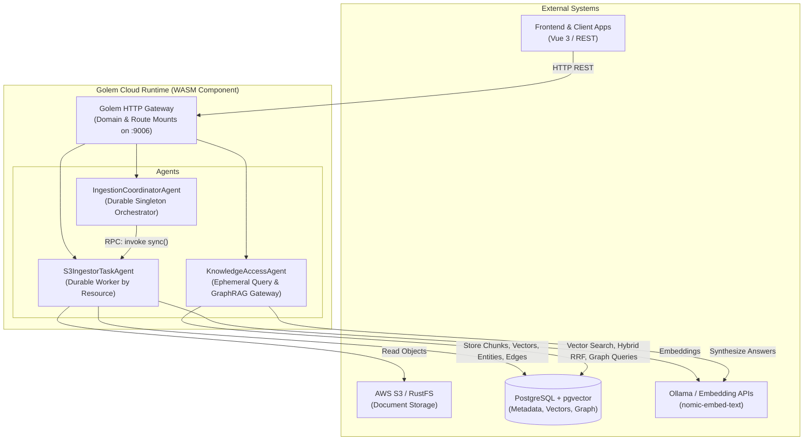
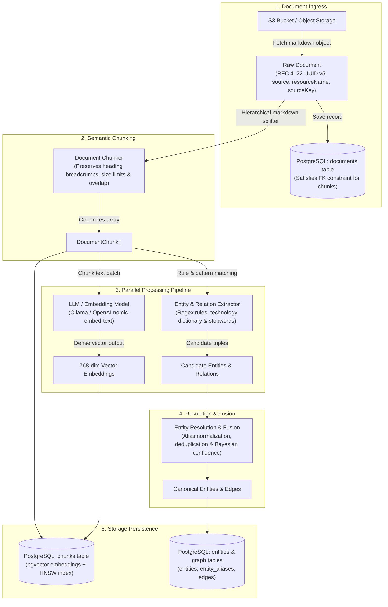

# Golem Knowledge Graph Service (golem-kgs-effect)

A durable, serverless Knowledge Graph and GraphRAG service built on [Golem Cloud](https://learn.golem.cloud) with TypeScript and [Effect](https://effect.website). It provides incremental document ingestion, semantic chunking, vector embeddings, entity/relation extraction, graph traversal, and hybrid search.

---

## Architecture



### Core Architecture Components

| System                           | Role                                                                                                                                                   |
| :------------------------------- | :----------------------------------------------------------------------------------------------------------------------------------------------------- |
| **Golem Cloud Runtime**          | WebAssembly host providing durable execution, automatic state recovery, transactional retry, and native HTTP routing.                                  |
| **PostgreSQL + pgvector**        | Persistent store for raw documents, text chunks, vector embeddings, entities, graph edges, and sync checkpoints (`@golemcloud/effect-golem/postgres`). |
| **S3 Storage (RustFS / AWS S3)** | Source document repositories scanned incrementally using ETag and timestamp checkpoints with AWS SigV4 authorization.                                  |
| **Ollama Embeddings**            | Generates 768-dimensional dense vector embeddings (`nomic-embed-text`) via OpenAI-compatible endpoints.                                                |

---

## Ingestion & Pipeline Flow

The ingestion pipeline converts source documents into a dual-representation knowledge base: dense vector embeddings for semantic similarity and a typed knowledge graph for multi-hop relational traversal.

### Pipeline Flow Diagram



### Ingestion Flow Overview

```
 ┌────────────────┐
 │  Raw Document  │ Source object from S3 (UUID v5, resourceName, sourceKey, title, metadata)
 └───────┬────────┘
         │
         ▼
 ┌────────────────────────────────┐
 │ Document Storage (PostgreSQL)  │ DocumentRepository.saveDocument
 │                                │ (Satisfies chunks.document_id foreign key constraint)
 └───────┬────────────────────────┘
         │
         ▼
 ┌────────────────────────┐
 │ Document Chunker       │ Splits Markdown into overlapping chunks with header breadcrumbs
 └───────┬────────────────┘
         │
         ├───▶ DocumentChunk[]
         │
 ┌───────┴────────────────────────┐
 │ Processing Pipeline            │
 │  1. Embedding Generation       │───▶ LLM / Embedding Model (Ollama / OpenAI nomic-embed-text)
 │     (Vector Embeddings)        │     Produces 768-dimensional normalized vectors
 │  2. Entity/Relation Extraction │───▶ Linguistic patterns, technology dictionary & stopwords
 │     (Graph Triples)            │     Produces candidate entities, aliases & relations
 └───────┬────────────────────────┘
         │
         ▼
 ┌────────────────────────────────┐
 │ Entity Resolution & Fusion     │ Matches aliases, deduplicates canonical entities,
 │                                │ merges properties, updates Bayesian confidence scores
 └───────┬────────────────────────┘
         │
         ▼
 ┌────────────────────────────────┐
 │ Storage Persistence (PG Repos) │ ChunkRepository  ──▶ Chunks + pgvector embeddings
 │                                │ EntityRepository ──▶ Canonical entities & aliases
 │                                │ GraphRepository  ──▶ Directed relationships (edges)
 └────────────────────────────────┘
```

#### Key Pipeline Stages:

1. **Raw Document Ingress**: S3 objects are fetched and assigned an RFC 4122 UUID v5 derived deterministically from `(source, resourceName, sourceKey)`. The document is persisted in the `documents` table first to satisfy foreign key constraints.
2. **Semantic Chunking**: Documents are split into semantic chunks respecting Markdown section hierarchy. Each chunk captures hierarchical heading breadcrumbs (e.g. `Architecture > Storage > Postgres`) for contextual relevance.
3. **LLM Embedding Invocation**: Chunk text is sent to an embedding model (e.g. `nomic-embed-text` via Ollama or OpenAI-compatible endpoint) generating normalized 768-dimensional vector embeddings.
4. **Entity & Relation Extraction**: Text chunks are parsed to identify domain entities, technology terms, acronyms, and semantic relationships using regex rules and linguistic patterns.
5. **Entity Resolution & Fusion**: Extracted candidates are matched against known aliases, canonicalized, deduplicated, and scored using Bayesian confidence fusion.
6. **Relational & Vector Persistence**: Chunks and embeddings are stored in the `chunks` table with pgvector HNSW indexing, while resolved entities and edges are stored in the graph schema for GraphRAG traversal.

### Relational & Graph Schema Design

The PostgreSQL storage layer enforces strict relational integrity, vector similarity search, and resource isolation:

- **`documents`**: Ingested source files keyed by deterministic RFC 4122 UUID v5 (`id VARCHAR(255) PRIMARY KEY`). Multi-tenant and multi-resource isolation is guaranteed by `CONSTRAINT uq_documents_source_resource_key UNIQUE (source, resource_name, source_key)`.
- **`chunks`**: Semantic markdown chunks referencing `documents(id) ON DELETE CASCADE` with `CONSTRAINT uq_chunks_document_chunk_index UNIQUE (document_id, chunk_index)`. Contains 768-dimensional `vector(768)` embeddings indexed with HNSW (`vector_cosine_ops`) alongside full-text search GIN indexing.
- **`entities`**: Canonical nodes identified by lowercase slug IDs (e.g. `golem-cloud`, `postgresql`), storing attributes in `properties JSONB` and metadata in `metadata JSONB`.
- **`entity_aliases`**: Alias-to-canonical lookup table keyed by `PRIMARY KEY (alias, entity_id)` referencing `entities(id) ON DELETE CASCADE`, indexed with trigram GIN for fuzzy matching.
- **`edges`**: Directed knowledge graph relationships keyed by natural compound primary key `PRIMARY KEY (source_id, target_id, relation_type)` referencing `entities(id) ON DELETE CASCADE`.
- **`entity_chunks`**: Provenance junction table keyed by composite `PRIMARY KEY (entity_id, chunk_id)` linking entities to source chunks for GraphRAG grounding.
- **`sync_checkpoints`**: Durable sync progress table keyed by `(source_type, resource_name)` tracking processed ETags, timestamps, and execution metrics.

---

## Agents & Core Functions

### 1. `IngestionCoordinatorAgent` (Singleton)

Central supervisor managing sync schedules, webhook ingress, and dispatching tasks to worker agents.

- **`POST /api/coordinator/sync`**: Triggers a manual sync run for a named S3 target.
- **`POST /api/coordinator/schedules`**: Registers or updates recurring cron sync schedules.
- **`POST /api/coordinator/schedules/pause`**: Pauses recurring sync schedules for a typed resource.
- **`POST /api/coordinator/schedules/resume`**: Resumes paused sync schedules for a typed resource.
- **`GET /api/coordinator/status`**: Inspects coordinator state, active schedules, and sync history.
- **`POST /api/coordinator/webhook/{sourceType}/{resourceName}`**: Receives external push notifications.

### 2. `S3IngestorTaskAgent` (Parameterized by Resource)

Dedicated worker agent executing the ETL pipeline for a specific storage target (`main`, `legal`, `technical`).

- **`POST /api/ingestion/s3/{resourceName}/sync`**: Discovers changed files in S3, parses Markdown, extracts headings/breadcrumbs, generates embeddings, extracts entity/relation triples, and commits to PostgreSQL.
- **`GET /api/ingestion/s3/{resourceName}/status`**: Returns current sync metrics, processed ETags, and timestamps.
- **`POST /api/ingestion/s3/{resourceName}/reset`**: Clears sync cursor to force a full re-index.

### 3. `KnowledgeAccessAgent` (Ephemeral / Stateless)

High-throughput query and retrieval interface exposing GraphRAG search, entity resolution, and graph traversal endpoints. Configured with `mode: "ephemeral"` for high concurrency.

- **`POST /api/knowledge/ask`**: GraphRAG question-answering with hybrid retrieval, multi-hop entity graph traversal, and answer synthesis with citations.
- **`POST /api/knowledge/graphrag`**: Context retrieval bundle for external LLM generation containing ranked chunks, canonical entities, relationships, and assembled context prompt.
- **`POST /api/knowledge/search`**: Hybrid search combining pgvector cosine distance and full-text search fused via Reciprocal Rank Fusion (RRF, $k=60$).
- **`POST /api/knowledge/entities/search`**: Entity search and autocomplete by prefix, name, alias, or keyword. Automatically returns top connected graph hubs when `query` is empty or omitted.
- **`POST /api/knowledge/entities/top`**: Retrieves top connected entities (graph hubs) sorted by degree (relationship count) and freshness.
- **`POST /api/knowledge/neighborhood`**: Multi-hop topological graph traversal around seed entities. Supports human entity names (e.g. `"PostgreSQL"`), aliases (e.g. `"postgres"`), or IDs with transparent resolution, returning complete entity records without data redundancy.
- **`POST /api/knowledge/paths`**: Relational shortest-path search between two entities. Supports natural entity names or IDs with transparent resolution and returns populated entity lookup pools.
- **`GET /api/knowledge/overview`**: Summary counts (documents, chunks, entities, relationships, last sync).
- **`GET /api/knowledge/entities/{id}`**: Entity metadata, attributes, and known aliases.
- **`GET /api/knowledge/documents/{id}`**: Raw document content, title, and metadata.

---

## HTTP Endpoints Quick Reference

| Agent           | Method | Route                                                  | Description                                                    |
| :-------------- | :----- | :----------------------------------------------------- | :------------------------------------------------------------- |
| **Knowledge**   | `GET`  | `/api/knowledge/overview`                              | Knowledge base statistics                                      |
| **Knowledge**   | `GET`  | `/api/knowledge/entities/{id}`                         | Entity lookup by ID                                            |
| **Knowledge**   | `GET`  | `/api/knowledge/documents/{id}`                        | Document lookup by ID                                          |
| **Knowledge**   | `POST` | `/api/knowledge/entities/search`                       | Entity autocomplete / search by prefix, name, or alias         |
| **Knowledge**   | `POST` | `/api/knowledge/entities/top`                          | Top connected entities (graph hubs) sorted by degree           |
| **Knowledge**   | `POST` | `/api/knowledge/search`                                | Hybrid RRF vector + keyword search                             |
| **Knowledge**   | `POST` | `/api/knowledge/graphrag`                              | GraphRAG context retrieval bundle (chunks, entities, edges)    |
| **Knowledge**   | `POST` | `/api/knowledge/ask`                                   | GraphRAG question answering with synthesized answer            |
| **Knowledge**   | `POST` | `/api/knowledge/neighborhood`                          | Entity neighborhood graph traversal (accepts names or IDs)     |
| **Knowledge**   | `POST` | `/api/knowledge/paths`                                 | Multi-hop path finding between entities (accepts names or IDs) |
| **Coordinator** | `GET`  | `/api/coordinator/status`                              | Coordinator status and active schedules                        |
| **Coordinator** | `POST` | `/api/coordinator/sync`                                | Trigger sync run                                               |
| **Coordinator** | `POST` | `/api/coordinator/schedules`                           | Set recurring cron schedule                                    |
| **Coordinator** | `POST` | `/api/coordinator/schedules/pause`                     | Pause sync schedule for a resource                             |
| **Coordinator** | `POST` | `/api/coordinator/schedules/resume`                    | Resume paused sync schedule for a resource                     |
| **Coordinator** | `POST` | `/api/coordinator/webhook/{sourceType}/{resourceName}` | Webhook ingress                                                |
| **Ingestor**    | `GET`  | `/api/ingestion/s3/{resourceName}/status`              | Ingestor status and checkpoint                                 |
| **Ingestor**    | `POST` | `/api/ingestion/s3/{resourceName}/sync`                | Trigger S3 resource sync                                       |
| **Ingestor**    | `POST` | `/api/ingestion/s3/{resourceName}/reset`               | Reset cursor for full rescan                                   |

---

## Configuration (`golem.yaml`)

Configuration is managed declaratively through [`golem.yaml`](./golem.yaml) using typed schemas parsed by [`AppAgentConfig`](./src/config/agent-config.ts). Configuration is split into **secrets** (credentials and keys) under `secretDefaults` and **public component settings** under `components.<component>.config`. Values support mustache-style `{{ ENV_VAR }}` interpolation from `.env` or shell environment variables.

### 1. Database & Embeddings Configuration

```yaml
secretDefaults:
  local:
    db:
      user: "{{ POSTGRES_USER }}"
      password: "{{ POSTGRES_PASSWORD }}"
    embedding:
      apiKey: "{{ EMBEDDING_API_KEY }}"

components:
  golem-kgs-effect:effect-main:
    config:
      db:
        host: "{{ POSTGRES_HOST }}"
        db: "{{ POSTGRES_DB }}"
        port: "{{ POSTGRES_PORT }}"
      embedding:
        api_base: "{{ EMBEDDING_API_BASE }}"
        model: "{{ EMBEDDING_MODEL }}"
```

### 2. S3 Storage Resources

Configured under `secretDefaults.local.resources.s3` as an array of named storage targets:

```yaml
secretDefaults:
  local:
    resources:
      s3:
        - name: "main"
          endpoint: "{{ S3_ENDPOINT_URL }}"
          region: "{{ AWS_DEFAULT_REGION }}"
          bucket: "golem-documents"
          prefixes:
            - "general/"
          accessKeyId: "{{ AWS_ACCESS_KEY_ID }}"
          secretAccessKey: "{{ AWS_SECRET_ACCESS_KEY }}"
        - name: "legal"
          endpoint: "{{ S3_ENDPOINT_URL }}"
          region: "{{ AWS_DEFAULT_REGION }}"
          bucket: "legal-docs"
          accessKeyId: "{{ AWS_ACCESS_KEY_ID }}"
          secretAccessKey: "{{ AWS_SECRET_ACCESS_KEY }}"
```

- **`name`**: Unique resource identifier used by `S3IngestorTaskAgent` (e.g. `/api/ingestion/s3/{resourceName}/sync`).
- **`endpoint` / `region`**: S3-compatible service URL (RustFS, MinIO, or AWS S3) and region.
- **`bucket` / `prefixes`**: Target bucket and optional key prefixes to scan incrementally.
- **`accessKeyId` / `secretAccessKey`**: S3 credentials (authenticated with AWS SigV4).

### 3. Entity & Relation Extraction Rules

Configured under `components.golem-kgs-effect:effect-main.config.extraction`:

```yaml
components:
  golem-kgs-effect:effect-main:
    config:
      extraction:
        # Co-occurrence Edge Extraction
        cooccurrence:
          enabled: true
          window: "sentence" # Proximity window: "sentence" or "chunk"
          confidence: 0.75 # Default edge confidence score
          relation: "CO_OCCURS_WITH"
          maxEdgesPerChunk: 25 # Maximum co-occurrence relationships per chunk

        # Domain Dictionary & Canonical Entity Aliases
        dictionary:
          - alias: "golem"
            canonical: "Golem Cloud"
          - alias: "effect"
            canonical: "Effect-TS"
          - alias: "postgresql"
            canonical: "PostgreSQL"
          - alias: "postgres"
            canonical: "PostgreSQL"
          - alias: "pgvector"
            canonical: "pgvector"

        # Phrase-Based Relation Extraction Patterns
        relationPatterns:
          - relation: "DEPENDS_ON"
            confidence: 0.85
            phrases:
              - "depends on"
              - "requires"
              - "relies on"
              - "uses"
          - relation: "AUTHORED_BY"
            confidence: 0.90
            phrases:
              - "authored by"
              - "written by"
              - "created by"
          - relation: "PART_OF"
            confidence: 0.85
            phrases:
              - "is part of"
              - "belongs to"

        # Stopwords (Exclusions from Title-Case Entity Extraction)
        stopwords:
          - "Table Of"
          - "The Following"
          - "For Example"
          - "In Addition"
```

### 4. HTTP API Gateway Deployment

Configured under `httpApi.deployments.local`:

```yaml
httpApi:
  deployments:
    local:
      - domain: localhost:9006
        agents:
          KnowledgeAccessAgent: {}
          IngestionCoordinatorAgent: {}
          S3IngestorTaskAgent: {}
```

Routes all agent APIs through a unified HTTP reverse proxy on `http://localhost:9006`.

### 5. Environment Variables Reference

| Variable                | Description                          | Default / Local Example     |
| :---------------------- | :----------------------------------- | :-------------------------- |
| `POSTGRES_HOST`         | PostgreSQL hostname / IP             | `127.0.0.1`                 |
| `POSTGRES_PORT`         | PostgreSQL port                      | `5432`                      |
| `POSTGRES_DB`           | Target database name                 | `golem_kg`                  |
| `POSTGRES_USER`         | Database user                        | `golem_user`                |
| `POSTGRES_PASSWORD`     | Database password                    | `golem_password`            |
| `S3_ENDPOINT_URL`       | S3 API endpoint URL                  | `http://127.0.0.1:9000`     |
| `AWS_DEFAULT_REGION`    | S3 region identifier                 | `us-east-1`                 |
| `AWS_ACCESS_KEY_ID`     | S3 access key ID                     | `rustfsadmin`               |
| `AWS_SECRET_ACCESS_KEY` | S3 secret access key                 | `rustfsadmin123`            |
| `EMBEDDING_API_BASE`    | OpenAI-compatible embedding base URL | `http://127.0.0.1:11434/v1` |
| `EMBEDDING_MODEL`       | Embedding model identifier           | `nomic-embed-text`          |
| `EMBEDDING_API_KEY`     | Embedding service API key            | `ollama`                    |

---

## Getting Started

### Prerequisites

- Node.js >= 20
- Docker Desktop
- [Golem CLI](https://learn.golem.cloud/install) >= 1.5.0
- Ollama with `nomic-embed-text`:
  ```bash
  ollama pull nomic-embed-text
  ```

### 1. Start Infrastructure

Start PostgreSQL with pgvector and RustFS (S3 storage):

```bash
docker compose up -d
```

### 2. Configure Environment

Copy and inspect `.env`:

```bash
cp .env.example .env
```

Ensure endpoints point to `127.0.0.1` on macOS to avoid IPv6 resolution issues:

```env
POSTGRES_HOST=127.0.0.1
POSTGRES_PORT=5432
S3_ENDPOINT_URL=http://127.0.0.1:9000
EMBEDDING_API_BASE=http://127.0.0.1:11434/v1
EMBEDDING_MODEL=nomic-embed-text
```

### 3. Build and Deploy

```bash
# Install dependencies & run tests
npm install
npm test

# Deploy to local Golem cluster
set -a && source .env && set +a
golem deploy --redeploy-agents --yes
```

The Golem HTTP Gateway will be active on **`http://localhost:9006`**.

### 4. Start Frontend

A Vue 3 + Vite visual explorer is available in [`frontend/`](./frontend/). For a visual walkthrough with screenshots, feature breakdowns, and frontend architecture details, see the [Frontend Documentation](./frontend/README.md).

```bash
cd frontend
npm install
npm run dev
```

Open **`http://localhost:5173`** to interact with the Knowledge Graph, Search, and Ask views.

---

## Example Usage

### Synchronize S3 Documents

```bash
curl -X POST 'http://localhost:9006/api/ingestion/s3/main/sync' \
  -H 'Content-Type: application/json' \
  -d '{"force": false}'
```

### GraphRAG Question Answering

```bash
curl -s --url 'http://localhost:9006/api/knowledge/ask' \
  -H 'Content-Type: application/json' \
  -d '{
    "query": "What is Golem Cloud and how does it achieve durable execution?",
    "topK": 5,
    "maxHops": 2,
    "generateAnswer": true
  }'
```

### Hybrid Search

```bash
curl -s --url 'http://localhost:9006/api/knowledge/search' \
  -H 'Content-Type: application/json' \
  -d '{
    "query": "database optimization",
    "limit": 5,
    "searchType": "hybrid"
  }'
```

### Knowledge Base Overview

```bash
curl -s http://localhost:9006/api/knowledge/overview
```

### Entity Search & Autocomplete

```bash
curl -s --url 'http://localhost:9006/api/knowledge/entities/search' \
  -H 'Content-Type: application/json' \
  -d '{
    "query": "postgres",
    "limit": 5
  }'
```

### Entity Neighborhood Traversal

```bash
curl -s --url 'http://localhost:9006/api/knowledge/neighborhood' \
  -H 'Content-Type: application/json' \
  -d '{
    "entityId": "PostgreSQL",
    "maxDepth": 2,
    "minConfidence": 0.7
  }'
```

### Relational Path Finding

```bash
curl -s --url 'http://localhost:9006/api/knowledge/paths' \
  -H 'Content-Type: application/json' \
  -d '{
    "sourceEntityId": "PostgreSQL",
    "targetEntityId": "Golem Cloud",
    "maxDepth": 3,
    "direction": "BOTH"
  }'
```

### GraphRAG Context Bundle Retrieval

```bash
curl -s --url 'http://localhost:9006/api/knowledge/graphrag' \
  -H 'Content-Type: application/json' \
  -d '{
    "query": "How does Golem Cloud use PostgreSQL for state storage?",
    "topK": 5,
    "maxHops": 2
  }'
```
