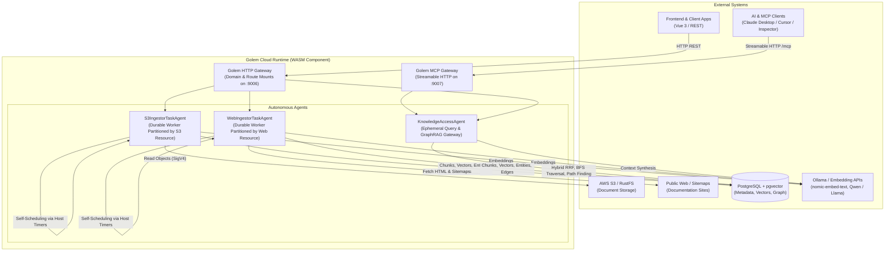
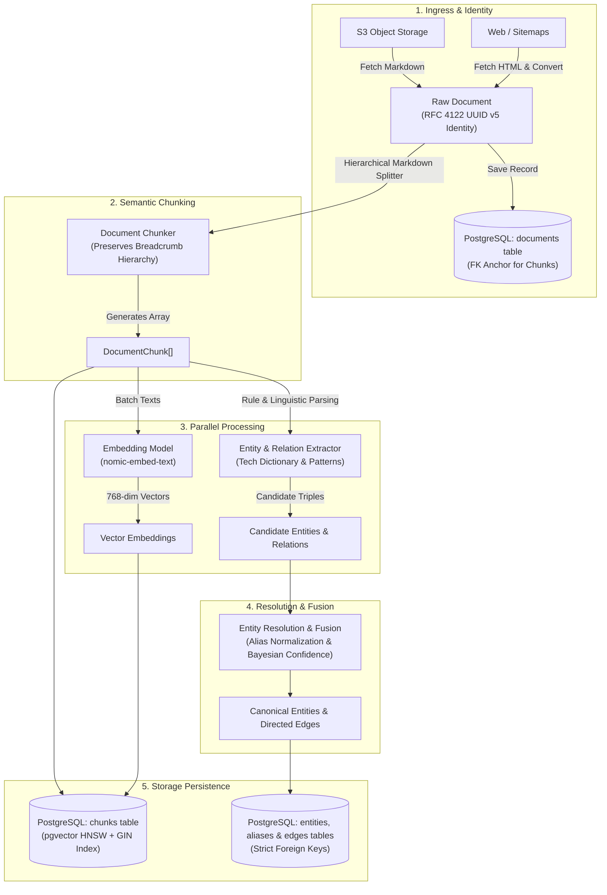

# Building a Serverless, Durable Knowledge Graph & GraphRAG Platform with Golem Cloud and Effect

Modern AI applications increasingly rely on **Retrieval-Augmented Generation (RAG)** to ground Large Language Models (LLMs) in proprietary facts. However, conventional vector-only RAG has critical blind spots: it struggles with **multi-hop relational reasoning**, fails to capture **hierarchical structures**, and lacks the explicit connectivity needed to answer questions like _"Which components depend on service X through transitive dependencies?"_ or _"What are all the entities related to topic Y across disparate documents?"_

To solve this, **GraphRAG** unites the semantic similarity of dense vector embeddings with the structural precision of a typed knowledge graph.

Yet, building an enterprise-grade GraphRAG system traditionally demands complex infrastructure: background worker pools, cron schedulers (Airflow, Celery), distributed queue managers (RabbitMQ, Redis), state orchestrators (Temporal), API gateways, and specialized vector/graph databases.

In this post, we explore how we built **[golem-kgs-effect](https://github.com/justcoon/golem-kgs-effect)**: an open-source, durable, serverless Knowledge Graph and GraphRAG service running on **[Golem Cloud](https://learn.golem.cloud)** with **TypeScript** and **[Effect](https://effect.website)**.

---

## 1. System Architecture: The Dual-Representation Engine

At the core of the service is a **dual-representation paradigm**: every ingested document is decomposed simultaneously into:

1. **Dense Vector Embeddings** (768-dimensional `nomic-embed-text`) stored in PostgreSQL with `pgvector` HNSW indexing for semantic similarity search.
2. **Typed Knowledge Graph Elements** (canonical entities, aliases, properties, and directed relationships with Bayesian confidence scores) stored in relational graph tables for multi-hop topological traversal.



### Core Architecture Components

- **Golem Cloud WebAssembly Host**: Runs QuickJS-compiled WebAssembly components providing **durable execution**. If a worker crashes or pauses mid-computation, Golem automatically replays its operation log and resumes execution seamlessly without data loss or duplicate external side effects.
- **PostgreSQL + pgvector**: A unified persistence layer configured via [`@golemcloud/effect-golem/postgres`](https://github.com/justcoon/golem-kgs-effect/blob/main/src/storage/database-client.ts). It enforces foreign-key relational integrity, maintains HNSW vector indices, powers full-text GIN search, and tracks durable sync checkpoints.
- **Dual Ingress Connectors**:
  - **S3 / RustFS Connector**: Scans S3 buckets using AWS SigV4 authorization, tracking ETags and timestamp checkpoints to execute incremental synchronization.
  - **Web / Sitemap Connector**: Recursively crawls documentation sites via `sitemap.xml` or seed URLs, stripping HTML boilerplate and transforming web pages into semantic Markdown via `node-html-markdown` while streaming with $O(1)$ memory consumption.
- **LLM & Embedding Services**: Integrates with local Ollama instances or OpenAI-compatible cloud endpoints (`nomic-embed-text` for 768-dim embeddings, and `qwen2.5:1.5b` or `llama3.2:3b` for natural language answer synthesis with deterministic fallbacks).
- **Dual Gateways**:
  - **HTTP Gateway (`:9006`)**: Direct REST API consumption for frontend apps and microservices.
  - **MCP Gateway (`:9007`)**: Streamable HTTP Model Context Protocol endpoint for direct connection to tools like Claude Desktop and Cursor.
- **Native OpenTelemetry Observability**: Golem's built-in `golem-otlp-exporter` plugin exports distributed traces, database query spans, and runtime metrics without bundling bulky third-party SDKs into WebAssembly. Telemetry routes through an OpenTelemetry Collector into Jaeger (`:16686`), Prometheus (`:9090`), and Grafana (`:3000`).

---

## 2. Ingestion & Pipeline Flow

The ingestion pipeline converts unstructured Markdown files and web pages into an interconnected, queryable knowledge base through a 5-stage ETL process:



### Deep Dive into the 5 Pipeline Stages

1. **Ingress & Deterministic Identity**:
   Every incoming document is assigned an **RFC 4122 UUID v5** deterministically generated from `(source, resourceName, sourceKey)`. Before chunking or embedding, the raw document is stored in the [`documents`](https://github.com/justcoon/golem-kgs-effect/blob/main/migrations/001_initial_schema.sql) table. This guarantees idempotent re-ingestion, multi-tenant isolation (`uq_documents_source_resource_key`), and satisfies foreign-key constraints for downstream chunks.
2. **Semantic Hierarchical Chunking**:
   The [`DocumentChunker`](https://github.com/justcoon/golem-kgs-effect/blob/main/src/pipeline/chunker.ts) splits Markdown documents while tracking the section hierarchy. Each chunk preserves breadcrumbs (e.g., `Architecture > Ingestion > Pipeline Flow`), token count bounds, and overlap. This context is embedded directly into the chunk text, ensuring embeddings retain contextual meaning even when detached from the parent document.
3. **Parallel Vector & Extraction Pipeline**:
   The chunk stream branches into two concurrent tasks:
   - **Vector Embeddings**: Normalized 768-dimensional dense vectors generated via [`EmbeddingService`](https://github.com/justcoon/golem-kgs-effect/blob/main/src/pipeline/embedding-service.ts).
   - **Entity & Relation Extraction**: The [`EntityExtractor`](https://github.com/justcoon/golem-kgs-effect/blob/main/src/pipeline/extractor.ts) applies linguistic rules, regex patterns, a curated technology dictionary, and stopword filters to identify candidate domain concepts (e.g., `Golem Cloud`, `PostgreSQL`, `pgvector`) and relations (e.g., `DEPENDS_ON`, `PART_OF`, `RELATES_TO`).
4. **Entity Resolution & Bayesian Fusion**:
   Extracted terms often contain aliases (e.g., `postgres` vs. `PostgreSQL`). The [`EntityResolver`](https://github.com/justcoon/golem-kgs-effect/blob/main/src/pipeline/entity-resolver.ts) resolves synonyms to a canonical slug (`postgresql`), merges properties, and uses Bayesian confidence updating:

   $$
   \text{Confidence}_{\text{new}} = 1 - (1 - \text{Confidence}_{\text{old}}) \times (1 - \text{Confidence}_{\text{match}})
   $$

   Repeated mentions across documents strengthen confidence without unbounded growth.

5. **Atomic Relational Persistence**:
   - Chunks and embeddings are stored in `chunks` with HNSW cosine indexing.
   - Entities and their aliases are stored in `entities` and `entity_aliases` (with trigram GIN indices for fuzzy lookup).
   - Directed relations are stored in `edges` with compound primary key `(source_id, target_id, relation_type)`.
   - The provenance table `entity_chunks` links graph nodes back to their source chunks, allowing full traceability from graph traversal back to source citations.

#### The Core Ingestion Pipeline in Effect

Here is how these five stages compose cleanly into a single typed Effect pipeline inside [`src/pipeline/document-processor.ts`](https://github.com/justcoon/golem-kgs-effect/blob/main/src/pipeline/document-processor.ts):

```typescript
/**
 * Shared document indexing pipeline in Effect:
 * Saves raw doc -> chunks hierarchically -> generates embeddings ->
 * upserts chunks -> extracts & resolves entities -> persists provenance links.
 */
export function processAndIndexDocument(
  document: RawDocument,
): Effect.Effect<
  void,
  SqlError | EmbeddingError,
  | DocumentRepository
  | ChunkRepository
  | EntityResolverService
  | EmbeddingService
  | ExtractionService
> {
  return Effect.gen(function* () {
    const docRepo = yield* DocumentRepository;
    const chunkRepo = yield* ChunkRepository;
    const entityResolver = yield* EntityResolverService;
    const embeddingService = yield* EmbeddingService;
    const extractionService = yield* ExtractionService;

    // 1. Ingress & deterministic document persistence
    yield* docRepo.saveDocument(document);

    // 2. Semantic hierarchical chunking
    const chunkResult = yield* DocumentChunker.chunkDocument(document);
    if (chunkResult.chunks.length === 0) return;

    // 3. Batch dense vector embedding generation
    const texts = chunkResult.chunks.map((c) => c.content);
    const embeddings = yield* embeddingService.generateEmbeddings(texts);

    // 4 & 5. Upsert chunks, extract entities/relations, and fuse into graph
    for (let i = 0; i < chunkResult.chunks.length; i++) {
      const chunk = chunkResult.chunks[i]!;
      yield* chunkRepo.upsertChunk({ ...chunk, embedding: embeddings[i] });

      const knowledge = yield* extractionService.extractFromChunk(chunk);
      yield* entityResolver.fuseKnowledge(knowledge);

      for (const entity of knowledge.entities) {
        yield* chunkRepo.linkEntityChunk({
          entityId: entity.id,
          chunkId: chunk.id,
          mentionText: entity.name,
          confidence: Number(entity.metadata?.confidence ?? 1.0),
        });
      }
    }
  });
}
```

---

## 3. Dynamic Sources & Secret-Driven Configuration

A key strength of the architecture is that **new data sources (S3 buckets, prefixes, or documentation sites) are added purely through configuration and secrets—zero code changes or redeployments required**.

Backed by [Golem Cloud's native Config & Secrets management](https://learn.golem.cloud/v1.5/develop/config-and-secrets), targets are defined in [`src/config/schema.ts`](https://github.com/justcoon/golem-kgs-effect/blob/main/src/config/schema.ts) and protected with Effect's `Schema.Redacted`. S3 and Web resource credentials are partitioned into dedicated secret schemas, allowing granular rotation and least-privilege scoping:

```typescript
export const ResourcesConfigFields = {
  resources: Schema.Struct({
    s3: Schema.Redacted(Schema.Array(S3ResourceTargetSchema)),
    web: Schema.Redacted(Schema.Array(WebResourceTargetSchema)),
  }),
};
```

To add a new target (e.g. a `legal` bucket or `effect-docs` crawler), simply define it in [`golem.yaml`](https://github.com/justcoon/golem-kgs-effect/blob/main/golem.yaml):

```yaml
agentSecretDefaults:
  - path: [resources, s3]
    secretValue:
      - name: "legal" # <-- Onboard a new S3 bucket
        endpoint: "{{ S3_ENDPOINT_URL }}"
        bucket: "corporate-legal-vault"
        prefixes: ["agreements/"]
        accessKeyId: "{{ LEGAL_S3_KEY }}"
        secretAccessKey: "{{ LEGAL_S3_SECRET }}"
  - path: [resources, web]
    secretValue:
      - name: "effect-docs" # <-- Onboard a new web documentation site
        baseUrl: "https://effect.website"
        seedUrls: ["https://effect.website/docs"]
```

### Least-Privilege Scoped Connector Layers

In standard microservice architectures, workers often load global credential bundles with access to all buckets and resources. In **golem-kgs-effect**, layer creation is strictly scoped per target resource via [`src/agents/connector-layers.ts`](https://github.com/justcoon/golem-kgs-effect/blob/main/src/agents/connector-layers.ts):

- **Strict Validation & Fail-Fast**: When `makeS3ConnectorLayer(config, resourceName)` or `makeWebConnectorLayer(config, resourceName)` is invoked, it validates that `resourceName` exists in secrets, immediately raising a typed `ConnectorError` during initialization if absent.
- **Credential Isolation**: The resulting `S3ResourceConfig` or `WebResourceConfig` service provided to the worker fiber contains **only** the configuration for that specific resource. A worker ingesting the `legal` bucket has zero access to the `financial` or `engineering` credentials in the secret store.
- **Direct Service Resolution**: The connector instance is bound directly to the environment as `S3ConnectorService` / `WebConnectorService`, eliminating artificial factory getters (`createConnector`) and multi-tenant map lookups inside worker pipelines.
- **Decoupled Architecture**: Pure connector layer factories are completely isolated from database drivers and native host bindings, allowing unit and integration tests to execute cleanly without external runtime dependencies.

```typescript
/**
 * Builds an S3 connector layer scoped strictly to a specific resource target.
 * Guarantees zero credential leakage across buckets and injects the connector directly.
 */
export const makeS3ConnectorLayer = (
  config: AppAgentConfigService,
  resourceName: string,
) =>
  Effect.gen(function* () {
    // 1. Unpack redacted configuration from Golem secrets
    const resourcesVal = Redacted.value(yield* config.resources.s3.get);
    const s3Targets = parseS3Targets(resourcesVal);
    const target = s3Targets[resourceName];

    if (!target) {
      return yield* Effect.fail(
        new ConnectorError({
          connectorId: `s3_${resourceName}`,
          message: `S3 resource target '${resourceName}' is not configured in secrets`,
        }),
      );
    }

    // 2. Inject target directly into S3ConnectorService.Live
    return S3ConnectorService.Live.pipe(
      Layer.provide(Layer.succeed(S3ResourceConfig, target)),
      Layer.provide(FetchHttpClient.layer),
    );
  });
```

Worker pipelines then resolve their designated connector with zero factory boilerplate:

```typescript
// Inside s3-ingestion-pipeline.ts — the connector IS the service
const connector = yield * S3ConnectorService;
const checkpointRepo = yield * CheckpointRepository;
```

### On-Demand Workers & Failure Isolation

Because ingestor agents are keyed by `resourceName` (`S3IngestorTaskAgent({ resourceName })`), invoking `/api/ingestion/s3/legal/sync` dynamically spins up an isolated, durable worker instance for that target. Each source maintains its own independent cursor, checkpoint table, and host-scheduled timer—ensuring complete **per-source failure isolation**.

---

## 4. The Agent Architecture: Durable Workers & Ephemeral Gateways

In Golem Cloud, agents are stateful WebAssembly actors that can be either **Durable** (state is persisted, invocations are sequential, and failures trigger replay) or **Ephemeral** (stateless, concurrent, high-throughput).

Our platform implements three specialized agents defined with `@golemcloud/effect-golem`:

```
┌─────────────────────────────────────────────────────────────┐
│                     Golem Cloud Runtime                     │
│                                                             │
│   DURABLE AGENTS (1:1 per Target)     EPHEMERAL GATEWAY     │
│  ┌──────────────────────────────┐    ┌──────────────────┐   │
│  │   S3IngestorTaskAgent        │    │ KnowledgeAccess  │   │
│  │   • Autonomous Host Timers   │    │ Agent            │   │
│  │   • State Snapshots (Oplog)  │    │ • Hybrid Search  │   │
│  │   • Status & Sync Metrics    │    │ • GraphRAG Q&A   │   │
│  └──────────────────────────────┘    │ • BFS Traversal  │   │
│  ┌──────────────────────────────┐    │ • MCP Server     │   │
│  │   WebIngestorTaskAgent       │    └──────────────────┘   │
│  │   • Autonomous Host Timers   │                           │
│  │   • Sitemap & Web Crawling   │                           │
│  │   • Streaming HTML Parser    │                           │
│  └──────────────────────────────┘                           │
└─────────────────────────────────────────────────────────────┘
```

### Agent 1: `S3IngestorTaskAgent` (Durable ETL Worker)

The [`S3IngestorTaskAgent`](https://github.com/justcoon/golem-kgs-effect/blob/main/src/agents/s3-task-agent.ts) is partitioned 1:1 by S3 resource name (e.g., `main`, `legal`, `technical`). Each agent instance maintains a lightweight durable state (lifecycle status, sync metrics, error logs, and scheduling status) and takes periodic snapshots using Golem's `Snapshot.define`. Incremental synchronization state (ETags and file timestamps) is persisted in the PostgreSQL `sync_checkpoints` table via [`CheckpointRepository`](https://github.com/justcoon/golem-kgs-effect/blob/main/src/storage/checkpoint-repository.ts), keeping the agent's durable snapshot footprint minimal (`< 1 KB`).

#### Agent Interface Definition

```typescript
export const S3IngestorTaskAgentDefinition = defineAgent({
  name: "S3IngestorTaskAgent",
  description:
    "Durable S3 ingestion task worker bound 1:1 to an S3 resource target",
  mode: "durable",
  config: AppAgentConfig,
  constructorParams: {
    resourceName: Schema.String,
  },
  http: Http.mount("/api/ingestion/s3/{resourceName}", { cors: ["*"] }),
  snapshot: Snapshot.define({
    schema: S3TaskStateSchema,
    policy: Snapshot.policy.everyN(5),
  }),
  methods: {
    sync: method({
      params: { force: Schema.optional(Schema.Boolean) },
      success: S3TaskStatusResponseSchema,
      description:
        "Executes full or incremental synchronization of the bound S3 resource",
      http: [Http.post("/sync")],
    }),
    getStatus: method({
      params: {},
      success: S3TaskStatusResponseSchema,
      description: "Returns the current synchronization state and metrics",
      http: [Http.get("/status")],
    }),
    resetCursor: method({
      params: {},
      success: S3TaskStatusResponseSchema,
      description:
        "Resets the sync cursor to force a full rescan on the next sync",
      http: [Http.post("/reset")],
    }),
    startSchedule: method({
      params: { intervalSeconds: Schema.Number },
      success: S3TaskStatusResponseSchema,
      description: "Starts recurring synchronization for this S3 resource",
      http: [Http.post("/schedule/start")],
    }),
    stopSchedule: method({
      params: {},
      success: S3TaskStatusResponseSchema,
      description: "Stops recurring synchronization for this S3 resource",
      http: [Http.post("/schedule/stop")],
    }),
    scheduledTick: method({
      params: {},
      success: Schema.Boolean,
      description:
        "Called by Golem host timer to execute scheduled sync and schedule next cycle",
    }),
  },
});
```

#### Self-Scheduling via Golem Host Timers

Instead of requiring an external cron service, the agent self-schedules its next execution using Golem's native timer runtime:

```typescript
const scheduleNextTick = (agent: S3TaskAgentHandle, intervalSeconds: number) =>
  Effect.gen(function* () {
    const fireAt = new Date(Date.now() + intervalSeconds * 1000);
    yield* agent.schedule(fireAt).scheduledTick();
  });
```

If the host server reboots or migrates, Golem preserves the durable timer and executes the invocation when due.

---

### Agent 2: `WebIngestorTaskAgent` (Durable Web Worker)

The [`WebIngestorTaskAgent`](https://github.com/justcoon/golem-kgs-effect/blob/main/src/agents/web-task-agent.ts) is partitioned 1:1 by web resource (e.g., `golem-docs`, `effect-specs`). It discovers web pages using `sitemap.xml` parsing or URL frontier traversal, converts HTML to clean Markdown, and streams processing with $O(1)$ body memory. Like the S3 agent, it persists URL ETags and content hashes directly to the PostgreSQL `sync_checkpoints` table, keeping its durable snapshot lightweight.

#### Agent Interface Definition

```typescript
export const WebIngestorTaskAgentDefinition = defineAgent({
  name: "WebIngestorTaskAgent",
  description:
    "Durable Web Page / Documentation ingestion task worker bound 1:1 to a web resource target",
  mode: "durable",
  config: AppAgentConfig,
  constructorParams: {
    resourceName: Schema.String,
  },
  http: Http.mount("/api/ingestion/web/{resourceName}", { cors: ["*"] }),
  snapshot: Snapshot.define({
    schema: WebTaskStateSchema,
    policy: Snapshot.policy.everyN(5),
  }),
  methods: {
    sync: method({
      params: { force: Schema.optional(Schema.Boolean) },
      success: WebTaskStatusResponseSchema,
      description:
        "Executes full or incremental synchronization of the bound Web resource",
      http: [Http.post("/sync")],
    }),
    getStatus: method({
      params: {},
      success: WebTaskStatusResponseSchema,
      description: "Returns the current synchronization state and metrics",
      http: [Http.get("/status")],
    }),
    resetCursor: method({
      params: {},
      success: WebTaskStatusResponseSchema,
      description:
        "Resets the sync cursor to force a full rescan on the next sync",
      http: [Http.post("/reset")],
    }),
    startSchedule: method({
      params: { intervalSeconds: Schema.Number },
      success: WebTaskStatusResponseSchema,
      description: "Starts recurring synchronization for this Web resource",
      http: [Http.post("/schedule/start")],
    }),
    stopSchedule: method({
      params: {},
      success: WebTaskStatusResponseSchema,
      description: "Stops recurring synchronization for this Web resource",
      http: [Http.post("/schedule/stop")],
    }),
    scheduledTick: method({
      params: {},
      success: Schema.Boolean,
      description:
        "Called by Golem host timer to execute scheduled sync and schedule next cycle",
    }),
  },
});
```

---

### Agent 3: `KnowledgeAccessAgent` (Ephemeral Query Gateway & MCP Server)

Configured with `mode: "ephemeral"`, the [`KnowledgeAccessAgent`](https://github.com/justcoon/golem-kgs-effect/blob/main/src/agents/access-agent.ts) handles concurrent search, graph traversal, and answer generation without persistent actor state overhead.

#### Agent Interface Definition

```typescript
export const KnowledgeAccessAgent = defineAgent({
  name: "KnowledgeAccessAgent",
  description:
    "Stateless ephemeral gateway for high-throughput concurrent search, graph traversal, GraphRAG, and question-answering",
  promptHint:
    "Query and explore the knowledge graph, retrieve documents, execute GraphRAG, and answer questions",
  mode: "ephemeral",
  config: AppAgentConfig,
  constructorParams: {},
  http: Http.mount("/api/knowledge", { cors: ["*"] }),
  methods: {
    // 1. Hybrid Vector + Full-Text Search
    search: method({
      params: {
        query: Schema.String,
        limit: Schema.optional(Schema.Number),
        searchType: Schema.optional(
          Schema.Literals(["hybrid", "vector", "keyword"]),
        ),
      },
      success: SearchResponseSchema,
      http: [Http.post("/search")],
    }),

    // 2. Entity Discovery & Graph Hubs
    searchEntities: method({
      params: {
        query: Schema.optional(Schema.String),
        limit: Schema.optional(Schema.Number),
      },
      success: EntitySearchResponseSchema,
      http: [Http.post("/entities/search")],
    }),
    getTopEntities: method({
      params: { limit: Schema.optional(Schema.Number) },
      success: EntitySearchResponseSchema,
      http: [Http.post("/entities/top")],
    }),

    // 3. Multi-Hop Neighborhood Exploration
    getNeighborhood: method({
      params: {
        entityId: Schema.String,
        maxDepth: Schema.optional(Schema.Number),
        relationTypes: Schema.optional(Schema.Array(Schema.String)),
        minConfidence: Schema.optional(Schema.Number),
      },
      success: NeighborhoodResponseSchema,
      http: [Http.post("/neighborhood")],
    }),

    // 4. Shortest Relational Path Finding
    findPaths: method({
      params: {
        sourceEntityId: Schema.String,
        targetEntityId: Schema.String,
        maxDepth: Schema.optional(Schema.Number),
        relationTypes: Schema.optional(Schema.Array(Schema.String)),
        direction: Schema.optional(
          Schema.Literals(["OUTBOUND", "INBOUND", "BOTH"]),
        ),
      },
      success: PathFindingResultSchema,
      http: [Http.post("/paths")],
    }),

    // 5. GraphRAG Context Retrieval
    graphRag: method({
      params: {
        query: Schema.String,
        topK: Schema.optional(Schema.Number),
        maxHops: Schema.optional(Schema.Number),
        minConfidence: Schema.optional(Schema.Number),
        relationTypes: Schema.optional(Schema.Array(Schema.String)),
      },
      success: GraphRAGContextBundleSchema,
      http: [Http.post("/graphrag")],
    }),

    // 6. Natural Language Question Answering
    ask: method({
      params: {
        query: Schema.String,
        topK: Schema.optional(Schema.Number),
        maxHops: Schema.optional(Schema.Number),
        generateAnswer: Schema.optional(Schema.Boolean),
      },
      success: AnswerResponseSchema,
      http: [Http.post("/ask")],
    }),

    // 7. Inspections & Metadata
    getEntity: method({
      params: { id: Schema.String },
      success: Schema.NullOr(EntityResultSchema),
      http: [Http.get("/entities/{id}")],
    }),
    getEntityDocuments: method({
      params: { id: Schema.String },
      success: Schema.Array(DocumentSummarySchema),
      http: [Http.get("/entities/{id}/documents")],
    }),
    getDocument: method({
      params: { id: Schema.String },
      success: Schema.NullOr(DocumentResultSchema),
      http: [Http.get("/documents/{id}")],
    }),
    getOverview: method({
      params: {},
      success: KnowledgeBaseOverviewSchema,
      http: [Http.get("/overview")],
    }),
  },
});
```

#### Key Capabilities in Action

- **Hybrid Search via Reciprocal Rank Fusion (RRF)**: Combines vector cosine similarity with PostgreSQL full-text search rankings using $RRF(d) = \sum \frac{1}{60 + \text{rank}(d)}$, delivering high recall for exact keywords alongside conceptual relevance.
- **Topological Graph Traversal**: Breadth-First Search (BFS) neighborhood traversal up to $N$ hops with dynamic edge filtering and Bayesian confidence pruning.
- **Relational Shortest Path Search**: Finds structural connections between disparate entities (e.g. `golem-cloud` $\xrightarrow{\text{DEPENDS\_ON}}$ `wasm` $\xleftarrow{\text{COMPILES\_TO}}$ `typescript`).
- **GraphRAG Question Answering (`/ask`)**: Fetches grounding chunks, discovers related entities and directed edges, structures the combined context, and invokes LLM synthesis with automatic citation generation.

#### The GraphRAG Retrieval & Context Synthesis Pipeline

Behind the `graphRag` and `ask` methods, [`src/pipeline/graphrag-service.ts`](https://github.com/justcoon/golem-kgs-effect/blob/main/src/pipeline/graphrag-service.ts) orchestrates hybrid semantic retrieval, seed entity extraction, and multi-hop topological graph traversal into a single unified context:

```typescript
/**
 * Hybrid GraphRAG context retrieval in Effect:
 * Dense vector + full-text RRF search -> extract seed entities ->
 * multi-hop topological graph traversal -> synthesize grounded prompt.
 */
const retrieveContext = (query: GraphRAGQuery) =>
  Effect.gen(function* () {
    const topK = query.topK ?? 5;
    const maxHops = Math.max(1, Math.min(query.maxHops ?? 2, 5));
    const minConfidence = query.minConfidence ?? 0.0;

    // 1. Generate dense query embedding
    const embedding = yield* embeddingService.generateEmbedding(query.query);

    // 2. Hybrid search across document chunks (Vector Cosine + Full-Text RRF)
    const relevantChunks = yield* chunkRepo.searchHybrid({
      query: query.query,
      embedding,
      limit: topK,
    });

    // 3. Extract seed entities (chunk mentions + direct name matches)
    const chunkIds = relevantChunks.map((c) => c.chunkId);
    const chunkEntityIds = yield* chunkRepo.getEntityIdsForChunks(chunkIds);
    const namedEntities = yield* entityRepo.searchByName(query.query, 5);
    const seedEntityIds = Array.from(
      new Set([...chunkEntityIds, ...namedEntities.map((e) => e.id)]),
    );

    // 4. Multi-hop topological graph traversal for relational context
    let entities: ReadonlyArray<Entity> = [];
    let relationships: ReadonlyArray<Edge> = [];
    if (seedEntityIds.length > 0) {
      const neighborhood = yield* graphRepo.getNeighborhood({
        seedEntityIds,
        depth: maxHops,
        relationTypes: query.relationTypes,
        minConfidence,
        limit: 50,
      });
      relationships = neighborhood.edges;
      entities = yield* entityRepo.findByIds(neighborhood.entityIds);
    }

    // 5. Synthesize grounded Markdown context prompt for LLM answer generation
    const formattedPrompt = formatContextPrompt(
      query.query,
      relevantChunks,
      entities,
      relationships,
    );

    return {
      query: query.query,
      entities,
      relationships,
      relevantChunks,
      formattedContextPrompt: formattedPrompt,
    };
  });
```

---

## 5. Native Model Context Protocol (MCP) Integration

Rather than building a separate MCP adapter, `KnowledgeAccessAgent` is exposed directly as an **MCP Server** via Golem's Streamable HTTP transport:

In [`golem.yaml`](https://github.com/justcoon/golem-kgs-effect/blob/main/golem.yaml):

```yaml
mcp:
  deployments:
    local:
      - domain: localhost:9007
        agents:
          KnowledgeAccessAgent: {}
```

Any MCP client (such as Claude Desktop or Cursor) connects directly to `http://localhost:9007/mcp`. All agent methods are automatically exposed as structured MCP tools (`KnowledgeAccessAgent-search`, `KnowledgeAccessAgent-graphRag`, `KnowledgeAccessAgent-ask`, etc.) complete with typed JSON schemas and prompt hints.

---

## 6. Interactive Frontend Explorer

To make the knowledge graph and GraphRAG capabilities accessible, we built an interactive visual web explorer with **Vue 3** and **Vite** (available in [`frontend/`](https://github.com/justcoon/golem-kgs-effect/tree/main/frontend)).

### Visual Feature Breakdown

1. **Force-Directed Graph Canvas**:
   A custom, high-performance HTML5 Canvas physics simulation that visualizes canonical entities as nodes and relationships as directed edges. Users can search entities with autocomplete, explore top connected hubs, expand node neighborhoods, and filter by edge type or confidence.
2. **Multi-Hop Relational Path Finder**:
   Users select a source and target entity to calculate and render the shortest relational path between them, highlighting intermediate nodes, edge weights, and relation types.
3. **Entity Detail & Provenance Drawer**:
   Clicking any entity slides out an inspector displaying its canonical attributes, alternative aliases, connected inbound/outbound relationships, and direct links to grounding document chunks.
4. **Hybrid Search Interface**:
   Provides immediate search over ingested documentation, allowing users to toggle between **Hybrid (RRF)**, **Vector**, and **Keyword** modes while displaying cosine similarity and rank scores.
5. **GraphRAG Question Answering**:
   An AI assistant view where natural language questions produce answers formatted in GitHub-Flavored Markdown with clickable source citations, expandable context bundles, and the traversed subgraph triples that justified the response.
6. **Raw Document & Section Modal**:
   Allows users to inspect original source Markdown documents, view section breadcrumbs, and inspect chunk token stats.

---

## 7. What Makes This Stack Unique?

### 1. Zero Infrastructure Baggage

In a standard architecture, achieving self-scheduling, fault-tolerant background ETL and high-throughput query handling requires maintaining Celery/Temporal workers, Redis message brokers, Cron jobs, and external API gateways. With **Golem Cloud**, each agent is a self-contained, durable WebAssembly actor with built-in timers, durable execution, and native HTTP/MCP routing.

### 2. Bulletproof Reliability with Effect-TS & Strict Typing

Writing distributed ETL pipelines in TypeScript is often plagued by silent errors, untracked async promises, and unhandled runtime exceptions. By leveraging **Effect**:

- **Fully Typed Error Handling**: Every failure mode (`ConnectorError`, `EmbeddingError`, `LlmSynthesisError`, `SqlError`) is tracked in function return types rather than thrown as untyped exceptions.
- **Zero Anti-Patterns & Strict Typing**: The entire codebase avoids unsafe `as unknown as Type` casts, loose `unknown` parameters, and redundant runtime assertions. Domain models (`VectorEmbedding`, `Entity`, `RawDocument`), storage rows (`CheckpointRow`, `EntityRow`), and generic `@effect/sql` queries are statically typed end-to-end.
- **Safe JSON Decoding**: Database JSON columns and metadata fields are typed with `string | Record<string, unknown> | null`, paired with type-safe `parseJsonOr` decoders that eliminate manual type assertions.
- **Resource Management**: Database connection pools and HTTP clients are safely scoped and composed with Effect `Layer` and `Scope`.
- **Declarative Concurrency**: Retries, timeouts, and structured parallelism are declarative, interruptible, and composable.

### 3. Explainable, Grounded AI

Pure vector search is a black box that often returns fragmented chunks lacking structural context. By merging vector embeddings with an explicit knowledge graph, **golem-kgs-effect** gives users and AI agents the best of both worlds: semantic discovery and verifiable, structured relational grounding.

### 4. Zero-Overhead OpenTelemetry Observability

Observability in WebAssembly is notoriously difficult when relying on traditional userland SDKs. With Golem's built-in `golem-otlp-exporter`, tracing happens natively at the host level:

- Every agent invocation (`/api/knowledge/overview`, `/api/knowledge/search`, `/api/knowledge/ask`) produces a root trace span.
- Every PostgreSQL operation (`sql.execute`) automatically records child spans with execution latencies.
- Telemetry feeds directly into an OpenTelemetry Collector routing to **Jaeger** (`http://localhost:16686`), **Prometheus** (`http://localhost:9090`), and **Grafana** (`http://localhost:3000`) without adding a single line of Node.js telemetry code to the agent.

---

## Summary & Getting Started

The complete project is open-source and available on GitHub at **[https://github.com/justcoon/golem-kgs-effect](https://github.com/justcoon/golem-kgs-effect)**.

To explore the code, deploy the agents, or run the frontend explorer locally:

```bash
# 1. Clone the repository
git clone https://github.com/justcoon/golem-kgs-effect.git
cd golem-kgs-effect

# 2. Start PostgreSQL, S3 (RustFS), Ollama, and the OpenTelemetry stack (Jaeger, Prometheus, Grafana)
docker compose up -d

# 3. Build and deploy Golem agents
npm install
golem build
golem deploy

# 4. Launch the frontend explorer
cd frontend
npm install
npm run dev
```

- **Frontend Explorer**: `http://localhost:5173`
- **Jaeger Traces UI**: `http://localhost:16686`
- **Prometheus Metrics**: `http://localhost:9090`
- **Grafana Dashboards**: `http://localhost:3000`
- **REST Gateway**: `http://localhost:9006`
- **MCP Gateway**: `http://localhost:9007/mcp`
