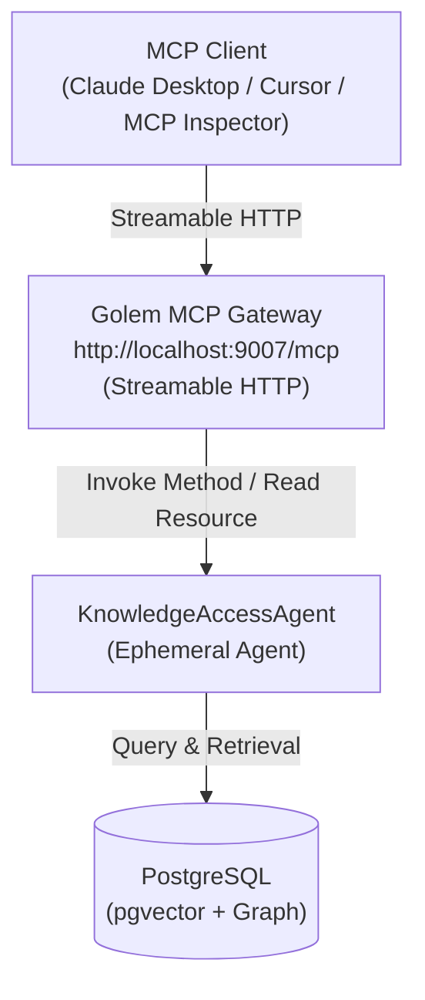

# Feature Plan: MCP Configuration for Knowledge Access Agent

- **Feature ID / Slug**: `access-agent-mcp`
- **Date**: 2026-09-10
- **Status**: Completed <!-- Draft | Approved | In Progress | Completed -->

---

## 1. Overview & Goals

The Model Context Protocol (MCP) allows AI clients (e.g., Claude Desktop, Cursor, MCP Inspector, local or cloud LLM agents) to seamlessly discover and execute tools, read resources, and utilize prompt templates exposed by services.

Golem provides native, zero-overhead MCP server support for Golem agents through its declarative application manifest (`golem.yaml`). Any agent can be exposed as an MCP server with Streamable HTTP transport on port 9007 for local development.

### Goals

1. **Manifest Configuration (`golem.yaml`)**:
   - Add the `mcp` deployment configuration to expose `KnowledgeAccessAgent` under the `local` environment at `localhost:9007`.
2. **Agent & Method Semantic Annotations (`src/agents/access-agent.ts`)**:
   - Add `promptHint` metadata to `KnowledgeAccessAgent` and each of its 11 methods (`search`, `searchEntities`, `getTopEntities`, `getNeighborhood`, `getEntity`, `getEntityDocuments`, `getDocument`, `graphRag`, `findPaths`, `ask`, `getOverview`).
   - Retain existing `description` fields, schemas, and HTTP endpoints intact.
3. **MCP Tool & Resource Mapping**:
   - Methods with parameters map automatically to MCP tools:
     - `KnowledgeAccessAgent-search`
     - `KnowledgeAccessAgent-searchEntities`
     - `KnowledgeAccessAgent-getTopEntities`
     - `KnowledgeAccessAgent-getNeighborhood`
     - `KnowledgeAccessAgent-getEntity`
     - `KnowledgeAccessAgent-getEntityDocuments`
     - `KnowledgeAccessAgent-getDocument`
     - `KnowledgeAccessAgent-graphRag`
     - `KnowledgeAccessAgent-findPaths`
     - `KnowledgeAccessAgent-ask`
   - Parameterless methods map automatically to MCP resources:
     - `KnowledgeAccessAgent-getOverview`
4. **Validation & Verification**:
   - Validate formatting (`npm run format:check`), type checking (`npm run typecheck`), linting (`npm run lint`), and build (`npm run build`).

### Non-Goals

- Setting up OIDC authentication for local MCP testing (public access for local dev server).
- Adding MCP configurations for ingestion coordinator or task workers (those are internal/orchestration workers; only the query/access agent is exposed).

---

## 2. Architecture & Technical Design

### MCP Architecture



### Auto-Mapped MCP Tools & Resources

| Agent Method | MCP Type | MCP Entity Name | Purpose / Prompt Hint |
|---|---|---|---|
| `search` | Tool | `KnowledgeAccessAgent-search` | Search ingested documents using hybrid, semantic vector, or keyword search |
| `searchEntities` | Tool | `KnowledgeAccessAgent-searchEntities` | Search knowledge graph entities by name, alias, or keyword |
| `getTopEntities` | Tool | `KnowledgeAccessAgent-getTopEntities` | List top connected hub entities in the knowledge graph sorted by connectivity degree |
| `getNeighborhood` | Tool | `KnowledgeAccessAgent-getNeighborhood` | Traverse and explore relationships and neighboring entities around an entity |
| `getEntity` | Tool | `KnowledgeAccessAgent-getEntity` | Look up an entity by its exact ID |
| `getEntityDocuments` | Tool | `KnowledgeAccessAgent-getEntityDocuments` | Get documents associated with or mentioning an entity |
| `getDocument` | Tool | `KnowledgeAccessAgent-getDocument` | Retrieve raw content and metadata for a document by its ID |
| `graphRag` | Tool | `KnowledgeAccessAgent-graphRag` | Execute GraphRAG retrieval returning structured context and synthesized prompt |
| `findPaths` | Tool | `KnowledgeAccessAgent-findPaths` | Find relationship paths connecting two entities in the graph |
| `ask` | Tool | `KnowledgeAccessAgent-ask` | Ask a natural language question to get a synthesized answer with source citations |
| `getOverview` | Resource | `KnowledgeAccessAgent-getOverview` | Retrieve knowledge base overview statistics (counts of documents, chunks, entities, relations) |

---

## 3. File-by-File Changes

### 1. `golem.yaml` `[MODIFY]`
Add the `mcp` section for the `local` environment:

```yaml
mcp:
  deployments:
    local:
      - domain: localhost:9007
        agents:
          KnowledgeAccessAgent: {}
```

### 2. `src/agents/access-agent.ts` `[MODIFY]`
Enrich `KnowledgeAccessAgent` and its methods with `promptHint` strings while preserving all schemas and logic.

---

## 4. Verification Plan

### Automated Verification
1. **Typecheck**:
   ```bash
   npm run typecheck
   ```
2. **Formatting & Linting**:
   ```bash
   npm run format:check
   npm run lint
   ```
3. **Golem Build**:
   ```bash
   npm run build
   ```

### Manual Verification
1. Inspect deployed endpoints and MCP definition:
   ```bash
   golem deploy --yes
   ```
2. Connect using MCP Inspector:
   ```bash
   npx @modelcontextprotocol/inspector
   ```
   Target URL: `http://localhost:9007/mcp`
