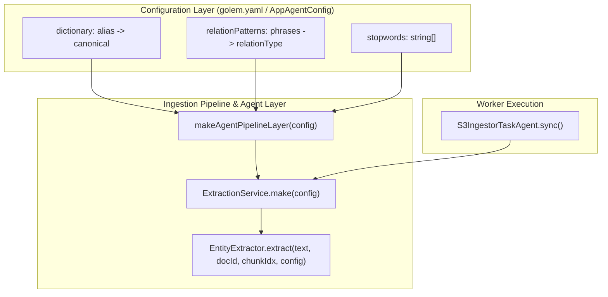

# Feature Plan: Configurable Entity & Relation Extraction Rules

- **Feature ID / Slug**: `configurable-extraction-rules`
- **Date**: 2026-09-07
- **Status**: Completed <!-- Draft | Approved | In Progress | Completed -->

---

## 1. Overview & Goals

Currently, [`EntityExtractor`](../../src/pipeline/extractor.ts) has two significant static, hardcoded elements:
1. **`KNOWN_TECHNOLOGIES`**: 17 hardcoded tech keywords (`golem`, `postgres`, `wasm`, `docker`, etc.).
2. **`relationPatterns`**: 4 hardcoded English regexes mapping phrases (`depends on`, `authored by`, `is part of`, `contains`) to `RelationType` with static confidences.
3. **`stopwords`**: 4 hardcoded phrases ignored during proper noun extraction (`Table Of`, `The Following`, `For Example`, `In Addition`).

### Problem Statement
- **Domain Bias**: The extraction engine is hardwired to software engineering. Processing legal contracts, financial reports, or medical documents yields false-positive tech matches and fails to extract domain-specific entities and relationships.
- **Code Coupling**: Any change to vocabulary or relation predicates requires editing TypeScript code, rebuilding the WebAssembly binary (`golem build`), and redeploying.

### Chosen Architecture: Pure Configuration (GitOps)
Rather than introducing database tables, runtime migrations, and caching layers, we adopt a **purely configuration-driven architecture** via `golem.yaml` and [`AppAgentConfig`](../../src/config/agent-config.ts):
- **Auditability**: All vocabulary and relation rules are tracked, versioned, and reviewed in Git.
- **Target Isolation**: Different S3 buckets (`legal`, `technical`, `main`) can specify tailored domain rules in `golem.yaml` without database table pollution or multi-tenant leakage.
- **Zero Latency & Complexity**: No extra DB queries or cache invalidation; rules are compiled once when the agent initializes.
- **Deterministic**: Immutable configuration per deployment revision ensures completely predictable runs.

---

## 2. Architecture & Technical Design



### Configuration Schema Definition

In [`src/config/schema.ts`](../../src/config/schema.ts):
```typescript
export const RelationPatternRuleSchema = Schema.Struct({
  relation: Schema.String,
  phrases: Schema.Array(Schema.String),
  confidence: Schema.optional(Schema.Number),
});
export type RelationPatternRule = typeof RelationPatternRuleSchema.Type;

export const ExtractionConfigSchema = Schema.Struct({
  dictionary: Schema.optional(Schema.Record(Schema.String, Schema.String)),
  relationPatterns: Schema.optional(Schema.Array(RelationPatternRuleSchema)),
  stopwords: Schema.optional(Schema.Array(Schema.String)),
});
export type ExtractionConfig = typeof ExtractionConfigSchema.Type;

export const ExtractionConfigFields = {
  extraction: Schema.optional(ExtractionConfigSchema),
};
```

> **Zero Hardcoded Code Defaults**: The TypeScript codebase defines no static vocabulary constants. If `extraction` configuration is omitted, the extractor safely falls back to empty collections (`{}` for dictionary, `[]` for relation patterns and stopwords) and relies purely on generic heuristic regexes (acronyms, proper nouns, file links). All domain vocabulary and relations are declared in `golem.yaml`.

### Dynamic Extractor Compilation

In [`src/pipeline/extractor.ts`](../../src/pipeline/extractor.ts):
- `EntityExtractor.extract` takes an optional `ExtractionRules` parameter (compiled regexes + dictionary map).
- Compiles the word boundary regexes for relation patterns dynamically:
  ```typescript
  const escapedPhrases = rule.phrases
    .map((p) => p.replace(/[.*+?^${}()|[\]\\]/g, "\\$&"))
    .join("|");
  const regex = new RegExp(
    `([A-Za-z0-9_.-]+(?:\\s+[A-Za-z0-9_.-]+){0,2})\\s+(?:${escapedPhrases})\\s+([A-Za-z0-9_.-]+(?:\\s+[A-Za-z0-9_.-]+){0,2})`,
    "i"
  );
  ```
- Compiles the word boundary regexes for dictionary lookup dynamically:
  ```typescript
  for (const [kw, canonical] of rules.dictionary.entries()) {
    const regex = new RegExp(`\\b${escapeRegex(kw)}\\b`, "i");
    if (regex.test(lowerText)) {
      addEntity(canonical, "TECHNOLOGY", 0.9);
    }
  }
  ```

---

## 3. Proposed Changes & File Impact

| Action | File Path | Description |
| :--- | :--- | :--- |
| `[MODIFY]` | [`src/config/agent-config.ts`](../../src/config/agent-config.ts) | Add `ExtractionConfigSchema`, `RelationPatternRuleSchema`, and default rules to `AppAgentConfigSchema`. |
| `[MODIFY]` | [`src/pipeline/extractor.ts`](../../src/pipeline/extractor.ts) | Remove hardcoded `KNOWN_TECHNOLOGIES` and hardcoded relation patterns; accept dynamic `ExtractionRules` in `EntityExtractor` and `ExtractionService`. |
| `[MODIFY]` | [`src/agents/agent-pipeline-layer.ts`](../../src/agents/agent-pipeline-layer.ts) | Extract `extractionConfig` from `AppAgentConfigService` and construct `ExtractionService` with configured rules. |
| `[MODIFY]` | [`golem.yaml`](../../golem.yaml) | Add default extraction rules configuration under `components.golem-kgs-effect:effect-main.config`. |
| `[MODIFY]` | [`test/pipeline.test.ts`](../../test/pipeline.test.ts) | Add tests for custom dictionaries, custom relation patterns, and custom stopwords (e.g. Legal domain test). |
| `[MODIFY]` | [`test/agents.test.ts`](../../test/agents.test.ts) | Verify agent pipeline wiring with configuration rules. |
| `[MODIFY]` | [`README.md`](../../README.md) | Document configuration options for entity dictionary and relation patterns. |

---

## 4. Verification Plan

### Automated Checks
- **Formatting Check**:
  ```bash
  npm run format:check
  ```
- **TypeScript Compilation**:
  ```bash
  npm run typecheck
  ```
- **ESLint**:
  ```bash
  npm run lint
  ```
- **Unit & Integration Tests**:
  ```bash
  npm test
  ```
- **Golem WebAssembly Component Build**:
  ```bash
  golem build --yes
  ```

### Functional Tests
1. **Default Config Behavior**: Ensure all 76 existing unit tests pass identically using the default fallback rules.
2. **Custom Domain Test**: Instantiate `EntityExtractor.extract` with a custom Legal domain config:
   - Dictionary: `gdpr` $\rightarrow$ `"General Data Protection Regulation"`
   - Relation Pattern: `GOVERNED_BY` with phrases `["governed by", "pursuant to"]`
   - Verify extracted entity is `"General Data Protection Regulation"` and relation edge is `GOVERNED_BY`.
3. **Empty Config Behavior**: Verify that when empty dictionary and empty patterns are supplied, the extractor safely extracts only regex acronyms and proper nouns without errors.

---

## 5. Risks & Trade-Offs

- **Trade-Off: Config vs DB**:
  - *Accepted Limitation*: Users cannot dynamically add a synonym via a REST API endpoint; updating vocabulary requires editing `golem.yaml` or deploying an updated configuration.
  - *Benefit*: Dramatically simpler architecture, zero database migrations, zero DB overhead, and 100% auditability through Git.
