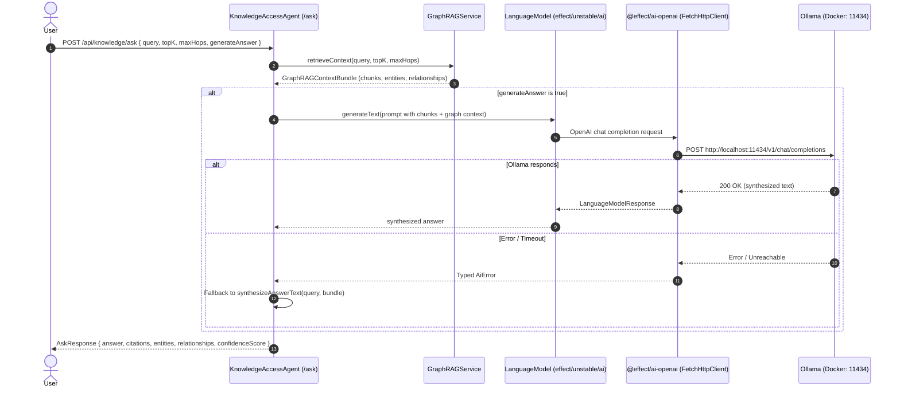

# Feature Plan: LLM-Powered Ask Endpoint Answer Synthesis with Lightweight Docker Model

- **Feature ID / Slug**: `llm-ask-synthesis`
- **Date**: 2026-09-12
- **Status**: Completed <!-- Draft | Approved | In Progress | Completed -->

---

## 1. Overview & Goals

The `ask` endpoint on `KnowledgeAccessAgent` currently relies on `synthesizeAnswerText`, a deterministic heuristic that concatenates raw text paragraphs from the top retrieved chunks and lists entities and relation triples as bullet points. It does not perform true question answering, context reasoning, or natural language summarization.

This feature integrates a lightweight local LLM (running via the existing Ollama container in Docker, e.g. `llama3.2:3b` or `qwen2.5:3b`) using Golem's approved `@effect/ai-openai` provider and `effect/unstable/ai` `LanguageModel` service. When a user queries `/api/knowledge/ask`, the agent retrieves the GraphRAG context bundle (chunks, entities, relationships), formats a grounded QA prompt, and uses the LLM to synthesize a natural, coherent, cited answer. If the LLM is unreachable or disabled, it falls back seamlessly to the deterministic formatter.

### Goals

1. **True Natural Language Synthesis**: Generate a direct, concise, and well-structured markdown answer answering the user's question using the retrieved GraphRAG evidence.
2. **Grounded GraphRAG Context**: Ground the LLM with both textual chunk excerpts and structured graph entities & relations to prevent hallucinations and enable multi-hop reasoning.
3. **Zero New Infrastructure (Lightweight Docker LLM)**: Leverage the existing `ollama` container in `docker-compose.yml` to serve `llama3.2:3b` (~2.0 GB VRAM/RAM) or `qwen2.5:3b` via its OpenAI-compatible `/v1/chat/completions` API.
4. **Adherence to Golem LLM Skill Guidelines**: Use pinned `@effect/ai-openai@4.0.0-beta.98`, `effect/unstable/ai` `LanguageModel`, and `FetchHttpClient.layer`, following `.agents/skills/golem-add-llm-effect/SKILL.md`.
5. **Resilient Fallback**: If the LLM call fails or times out, gracefully fall back to `synthesizeAnswerText` so the `/ask` endpoint never fails abruptly.

### Non-Goals

- Streaming answers via SSE/WebSockets (the current `/ask` endpoint contract is synchronous request/response).
- Fine-tuning or training local models.
- Heavyweight 70B+ models requiring enterprise GPUs.

---

## 2. Architecture & Technical Design

### Component Interaction



### Key Decisions

1. **Dependency: `@effect/ai-openai@4.0.0-beta.98`**:
   - Pinned exact version matching installed `effect: 4.0.0-beta.98` per `golem-add-llm-effect` skill.
   - Externalized by Rollup alongside `effect` and `@golemcloud/effect-golem`.
2. **Model Selection: `llama3.2:3b` (Default) or `qwen2.5:3b`**:
   - `llama3.2:3b`: 2.0 GB RAM footprint, highly optimized for on-device RAG and instruction following. Runs at 40–70 tok/s on modern CPU/Apple Silicon.
   - Configurable via `LLM_MODEL` environment variable and `golem.yaml`.
3. **Configuration & Secrets Architecture**:
   - Add `LlmConfigFields` into `src/config/schema.ts` and `AppAgentConfig`:
     - `api_base`: string (e.g., `http://localhost:11434/v1` or `http://ollama:11434/v1`)
     - `model`: string (e.g., `llama3.2:3b`)
     - `apiKey`: `Schema.Redacted(Schema.String)` (e.g., `"ollama"`)
   - Configured in `golem.yaml` under `config` and `secretDefaults`.
4. **Layer Composition (`makeAccessAgentLayer`)**:
   - Construct `OpenAiClient.layer({ apiKey, apiUrl })` using `FetchHttpClient.layer`.
   - Provide `OpenAiLanguageModel.layer({ model })` to supply `LanguageModel.LanguageModel`.
   - Wire into `KnowledgeAccessAgent`'s pipeline layer.
5. **Prompt Engineering for GraphRAG Context**:
   - System prompt instructs model to act as a factual Knowledge Graph assistant, answer directly and concisely, cite document titles/IDs, incorporate relationship insights, and explicitly state if context is insufficient.

---

## 3. Proposed Changes & File Impact

| Action     | File Path                                          | Description                 |
| :--------- | :------------------------------------------------- | :-------------------------- |
| `[MODIFY]` | [`package.json`](file:///Users/coon/workspace-zv/git/golem-kgs-effect/package.json) | Add `@effect/ai-openai: 4.0.0-beta.98` exact dependency. |
| `[MODIFY]` | [`docker-compose.yml`](file:///Users/coon/workspace-zv/git/golem-kgs-effect/docker-compose.yml) | Update `ollama-setup` to pull `${LLM_MODEL}` alongside `${OLLAMA_MODEL}`. |
| `[MODIFY]` | [`.env.example`](file:///Users/coon/workspace-zv/git/golem-kgs-effect/.env.example) and `.env` | Add `LLM_MODEL=llama3.2:3b`, `LLM_API_BASE=http://localhost:11434/v1`, `LLM_API_KEY=ollama`. |
| `[MODIFY]` | [`golem.yaml`](file:///Users/coon/workspace-zv/git/golem-kgs-effect/golem.yaml) | Add `llm` section to `secretDefaults` and `components.golem-kgs-effect:effect-main.config`. |
| `[MODIFY]` | [`src/config/schema.ts`](file:///Users/coon/workspace-zv/git/golem-kgs-effect/src/config/schema.ts) | Add `LlmConfigFields`, `LlmConfigSchema`, and `LlmConfigValues` service. |
| `[MODIFY]` | [`src/config/agent-config.ts`](file:///Users/coon/workspace-zv/git/golem-kgs-effect/src/config/agent-config.ts) | Merge `LlmConfigFields` into `AppAgentConfig`. |
| `[NEW]`    | [`src/pipeline/llm-service.ts`](file:///Users/coon/workspace-zv/git/golem-kgs-effect/src/pipeline/llm-service.ts) | Provide `LlmSynthesisService` with prompt formatting and `generateAnswer` Effect using `LanguageModel`. |
| `[MODIFY]` | [`src/agents/agent-pipeline-layer.ts`](file:///Users/coon/workspace-zv/git/golem-kgs-effect/src/agents/agent-pipeline-layer.ts) | Add `makeLlmLayer` and incorporate into `makeAccessAgentLayer`. |
| `[MODIFY]` | [`src/agents/access-agent.ts`](file:///Users/coon/workspace-zv/git/golem-kgs-effect/src/agents/access-agent.ts) | Use `LlmSynthesisService` in `ask` method with fallback to `synthesizeAnswerText`. |
| `[NEW]`    | [`test/llm-service.test.ts`](file:///Users/coon/workspace-zv/git/golem-kgs-effect/test/llm-service.test.ts) | Unit tests verifying prompt construction, mocked LLM synthesis, and fallback behavior. |
| `[MODIFY]` | [`README.md`](file:///Users/coon/workspace-zv/git/golem-kgs-effect/README.md) | Update prerequisites (Ollama LLM model pull), environment variable table, architecture diagram/notes, and `ask` endpoint documentation. |

---

## 4. Verification Plan

### Automated Checks
```bash
# 1. Formatting
npm run format:check

# 2. TypeScript compilation
npm run typecheck

# 3. ESLint verification
npm run lint

# 4. Automated unit tests
npm test

# 5. Golem component WASM build
npm run build
```

### Manual / Integration Verification
1. Ensure Ollama container is running with model pulled:
   ```bash
   docker exec -it golem-kg-ollama ollama pull llama3.2:3b
   ```
2. Trigger `/api/knowledge/ask` endpoint with a test query (e.g. asking about Golem or indexed documents) and verify that the returned `answer` is a fluent, synthesized natural language paragraph referencing specific sources, rather than a raw paragraph dump.
3. Test fallback behavior by temporarily stopping Ollama or pointing `api_base` to an invalid port: verify that `/api/knowledge/ask` gracefully returns the deterministic template answer without erroring.

---

## 5. Risks & Open Questions

- **Cold Start Latency in Docker**:
  - *Risk*: When Ollama loads the 3B model into memory on the first request, response time can take ~2-3 seconds. Subsequent requests take ~200-500ms.
  - *Mitigation*: The fallback timeout ensures the agent doesn't stall indefinitely, and Ollama keeps models warm in memory for 5 minutes by default (`OLLAMA_KEEP_ALIVE`).
- **Memory Overhead**:
  - *Risk*: Running both `nomic-embed-text` (~300MB) and `llama3.2:3b` (~2GB) in Ollama requires ~2.5GB RAM.
  - *Mitigation*: Both fit comfortably in standard developer laptops and Docker default allocations (4GB+). If resources are constrained, `qwen2.5:1.5b` (~1GB) can be selected via `LLM_MODEL` with zero code changes.
