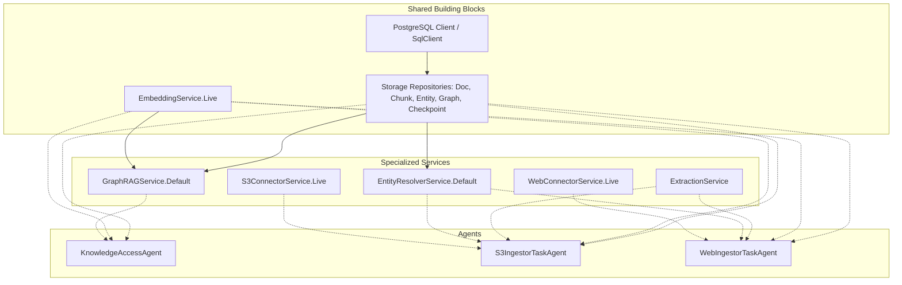

# Feature Plan: Modular Agent Pipeline Layers

- **Feature ID / Slug**: `modular-agent-pipeline-layers`
- **Date**: 2026-09-11
- **Status**: Draft <!-- Draft | Approved | In Progress | Completed -->

---

## 1. Overview & Goals

In the current implementation, [`src/agents/agent-pipeline-layer.ts`](../../src/agents/agent-pipeline-layer.ts) provides a single monolithic layer factory: `makeAgentPipelineLayer`. This mega-layer unconditionally instantiates and binds **all** storage repositories, the S3 connector, the Web connector, extraction rules, entity resolution, embedding, and GraphRAG services.

All three worker/access agents (`KnowledgeAccessAgent`, `S3IngestorTaskAgent`, and `WebIngestorTaskAgent`) currently instantiate this identical mega-layer. However, their actual runtime requirements are fundamentally different and disjoint:
- `KnowledgeAccessAgent` is a read-only query/search agent. It does not need S3/Web connector services, extraction rules, entity resolution, or checkpoint repositories.
- `S3IngestorTaskAgent` is an S3 ingestion worker. It does not need the Web connector service or GraphRAG query service.
- `WebIngestorTaskAgent` is a web crawl ingestion worker. It does not need the S3 connector service or GraphRAG query service.

### Goals

- Decompose `src/agents/agent-pipeline-layer.ts` into modular, reusable Effect layer builders.
- Provide targeted layer factory functions:
  - `makeAccessAgentLayer(config)`: tailored specifically for `KnowledgeAccessAgent`.
  - `makeS3TaskAgentLayer(config)`: tailored specifically for `S3IngestorTaskAgent`.
  - `makeWebTaskAgentLayer(config)`: tailored specifically for `WebIngestorTaskAgent`.
  - `makeAgentPipelineLayer(config)`: preserved as a composite layer uniting all services for backwards compatibility and integration tests.
- Update `access-agent.ts`, `s3-task-agent.ts`, and `web-task-agent.ts` to consume their respective dedicated layers.
- Avoid parsing and validating unneeded configuration resources (e.g. S3 credentials in `KnowledgeAccessAgent` or `WebIngestorTaskAgent`).
- Ensure all 125 existing tests pass, add automated tests verifying the modular layer construction, and ensure `golem build --yes` builds cleanly.

### Non-Goals

- Refactoring the agent public interfaces (HTTP routes, Golem method contracts, or Schemas remain untouched).
- Modifying `IngestionCoordinatorAgent` (which does not use pipeline layers and interacts via Golem agent RPC).

---

## 2. Architecture & Technical Design

### Analysis of Agent Service Dependencies



### Modular Layer Structure

In `src/agents/agent-pipeline-layer.ts`:

1. **`makeStorageAndRepositoriesLayer(config)`**:
   - Creates Postgres client using `createPostgresClient(config)`.
   - Binds `sqlLayer = Layer.succeed(SqlClient.SqlClient, sql)`.
   - Returns `sqlLayer` and `reposLayer` (`DocumentRepository`, `ChunkRepository`, `CheckpointRepository`, `EntityRepository`, `GraphRepository`).

2. **`makeEmbeddingLayer(config)`**:
   - Reads embedding config values (`api_base`, `model`, `apiKey`).
   - Combines `EmbeddingConfigValues` layer and `FetchHttpClient.layer` into `EmbeddingService.Live`.

3. **`makeIngestionSemanticLayer(config, reposLayer)`**:
   - Parses `config.extraction` into `ExtractionConfig` and builds `ExtractionService.make(rules)`.
   - Builds `EntityResolverService.Default.pipe(Layer.provide(reposLayer))`.

4. **`makeS3ConnectorLayer(config)`**:
   - Parses only S3 resource targets from `config.resources`.
   - Builds `ResourcesConfigValues` with `s3Targets`.
   - Provides to `S3ConnectorService.Live`.

5. **`makeWebConnectorLayer(config)`**:
   - Parses only Web resource targets from `config.resources`.
   - Builds `ResourcesConfigValues` with `webTargets`.
   - Provides to `WebConnectorService.Live`.

6. **`makeGraphRAGLayer(reposLayer, embeddingLayer)`**:
   - Builds `GraphRAGService.Default.pipe(Layer.provide(reposLayer), Layer.provide(embeddingLayer))`.

### Dedicated Agent Layer Constructors

```typescript
// For KnowledgeAccessAgent
export const makeAccessAgentLayer = (configOrApp?: AppAgentConfigService) =>
  Effect.gen(function* () {
    const config = configOrApp ?? (yield* AppAgentConfig);
    const { sqlLayer, reposLayer } = yield* makeStorageAndRepositoriesLayer(config);
    const embeddingLayer = yield* makeEmbeddingLayer(config);
    const graphRagLayer = makeGraphRAGLayer(reposLayer, embeddingLayer);

    return Layer.mergeAll(sqlLayer, reposLayer, embeddingLayer, graphRagLayer);
  });

// For S3IngestorTaskAgent
export const makeS3TaskAgentLayer = (configOrApp?: AppAgentConfigService) =>
  Effect.gen(function* () {
    const config = configOrApp ?? (yield* AppAgentConfig);
    const { sqlLayer, reposLayer } = yield* makeStorageAndRepositoriesLayer(config);
    const embeddingLayer = yield* makeEmbeddingLayer(config);
    const { extractionLayer, resolverLayer } = yield* makeIngestionSemanticLayer(config, reposLayer);
    const s3Layer = yield* makeS3ConnectorLayer(config);

    return Layer.mergeAll(sqlLayer, reposLayer, resolverLayer, embeddingLayer, s3Layer, extractionLayer);
  });

// For WebIngestorTaskAgent
export const makeWebTaskAgentLayer = (configOrApp?: AppAgentConfigService) =>
  Effect.gen(function* () {
    const config = configOrApp ?? (yield* AppAgentConfig);
    const { sqlLayer, reposLayer } = yield* makeStorageAndRepositoriesLayer(config);
    const embeddingLayer = yield* makeEmbeddingLayer(config);
    const { extractionLayer, resolverLayer } = yield* makeIngestionSemanticLayer(config, reposLayer);
    const webLayer = yield* makeWebConnectorLayer(config);

    return Layer.mergeAll(sqlLayer, reposLayer, resolverLayer, embeddingLayer, webLayer, extractionLayer);
  });
```

---

## 3. Proposed Changes & File Impact

| Action     | File Path                                                                   | Description                                                                                                                                                |
| :--------- | :-------------------------------------------------------------------------- | :--------------------------------------------------------------------------------------------------------------------------------------------------------- |
| `[MODIFY]` | [`src/agents/agent-pipeline-layer.ts`](../../src/agents/agent-pipeline-layer.ts) | Refactor into modular building blocks and add `makeAccessAgentLayer`, `makeS3TaskAgentLayer`, `makeWebTaskAgentLayer`, keeping `makeAgentPipelineLayer`.   |
| `[MODIFY]` | [`src/agents/access-agent.ts`](../../src/agents/access-agent.ts)             | Replace `makeAgentPipelineLayer` with `makeAccessAgentLayer`.                                                                                              |
| `[MODIFY]` | [`src/agents/s3-task-agent.ts`](../../src/agents/s3-task-agent.ts)           | Replace `makeAgentPipelineLayer` with `makeS3TaskAgentLayer`.                                                                                              |
| `[MODIFY]` | [`src/agents/web-task-agent.ts`](../../src/agents/web-task-agent.ts)         | Replace `makeAgentPipelineLayer` with `makeWebTaskAgentLayer`.                                                                                             |
| `[MODIFY]` | [`src/agents/index.ts`](../../src/agents/index.ts)                           | Export the new modular layer factories (`makeAccessAgentLayer`, etc.).                                                                                     |
| `[NEW]`    | [`test/agent-pipeline-layer.test.ts`](../../test/agent-pipeline-layer.test.ts) | Add unit tests verifying that each layer builder constructs the exact required services without error and doesn't require unused credentials.              |

---

## 4. Verification Plan

### Automated Checks

- **Code Formatting**:
  ```bash
  npm run format:check # npx prettier --check src/ test/
  ```
- **Type Checking**:
  ```bash
  npm run typecheck   # npx tsc --noEmit
  ```
- **Linter Verification**:
  ```bash
  npm run lint        # npx eslint src/ test/
  ```
- **Golem Component Build**:
  ```bash
  npm run build       # golem build --yes
  ```
- **Automated Tests**:
  ```bash
  npm test            # npx tsx --test
  ```

---

## 5. Risks & Open Questions

- **Backwards Compatibility**:
  - *Mitigation*: `makeAgentPipelineLayer` will be kept as a composite wrapper of all modular layers. No existing imports or external consumers will break.
- **Shared AppAgentConfig**:
  - All three agents still declare `config: AppAgentConfig`. The modular builders will extract only their relevant sub-configurations from `AppAgentConfig`. If an agent does not have S3 configured, `makeAccessAgentLayer` and `makeWebTaskAgentLayer` will not fail.
