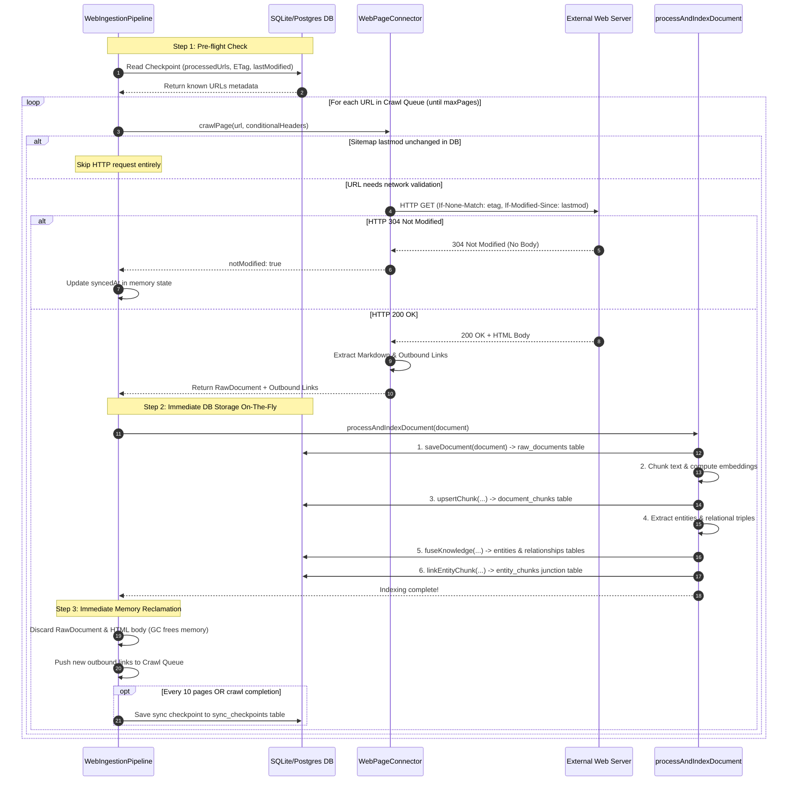

# Feature Plan: On-The-Fly Web Ingestion & Minimal Memory Footprint

- **Feature ID / Slug**: `on-the-fly-web-ingestion`
- **Date**: 2026-09-11
- **Status**: Completed <!-- Draft | Approved | In Progress | Completed -->

---

## 1. Overview & Goals

Currently, web ingestion executes in two disconnected batch phases:
1. **`discover()`**: Crawls seed URLs, downloads full HTML pages, stashes them in an in-memory cache, and extracts links until `maxPages` is reached.
2. **Pipeline loop**: Iterates over all discovered items, fetches from the cache, chunks, extracts entities, and writes to the database.

This two-phase approach causes:
- **Unnecessary memory retention**: Full HTML bodies of up to hundreds of pages remain buffered in memory before the first document is written to the database.
- **Delayed availability**: Documents are not indexed into SQLite/Postgres until the entire crawl completes.
- **Redundant network requests**: If a page is already indexed in the DB and unchanged, the crawler still downloads its full body during discovery.

### Goals

- **On-The-Fly Ingestion**: Crawl, extract, chunk, embed, and store each web page into the database immediately upon fetching, discarding the HTML body from memory immediately ($O(1)$ page body memory).
- **Check DB / Checkpoint First**:
  - Before fetching a page body, inspect `processedUrls` in the checkpoint/DB.
  - Support HTTP `304 Not Modified` via conditional `If-None-Match` (ETag) and `If-Modified-Since` headers to avoid downloading unchanged page bodies.
  - For sitemaps, compare `lastmod` against the DB record and skip unchanged URLs without issuing an HTTP GET for the page.
- **Minimal Cache / State**:
  - Eliminate the full HTML body cache (`pageCache`).
  - Keep only the bare minimum crawl frontier in memory: a `Set<string>` of visited URLs and a queue of URLs to visit.
- **Progressive Checkpoints**:
  - Periodically commit checkpoints to `CheckpointRepository` during crawling so progress is resilient to interruptions.
- **Contract & Test Compatibility**:
  - Maintain `SourceConnector` contract (`connect`, `discover`, `fetch`, `checkpoint`) for backward compatibility with existing tests and generic connector consumers.

### Non-Goals

- Changing S3 ingestion (S3 already lists metadata without downloading file bodies).
- Redesigning the vector embedding or graph extraction services.

---

## 2. Architecture & Technical Design



### Detailed Ingestion Lifecycle: Where & When Data is Stored

| Stage | Operation | What is happening? | Memory State | Database State |
| :--- | :--- | :--- | :--- | :--- |
| **1. Pre-Check** | DB Checkpoint lookup | Lookup `url` in `currentState.processedUrls`. If `etag` or `lastModified` exists, attach conditional headers. | Only URL strings in queue/visited set. | Read-only check on `sync_checkpoints`. |
| **2. Fetch / Validate** | HTTP Request | Send `GET` with `If-None-Match` / `If-Modified-Since`. If `304 Not Modified`, skip to Stage 6. If `200`, receive body. | Single HTML page in memory ($<1$ MB). | Unchanged. |
| **3. Link Extraction** | HTML Parsing | Parse `<a>` tags; filter via `isUrlAllowed`. Queue new unvisited URLs. | HTML page + array of link strings. | Unchanged. |
| **4. Raw Document Persist** | `docRepo.saveDocument` | **First DB write**: Store document metadata, title, and full text in the DB. | `RawDocument` in memory. | **Stored in `raw_documents` table.** |
| **5. Semantic Indexing** | `processAndIndexDocument` | Chunks text, generates vector embeddings, extracts knowledge graph triples, links entities. | Chunks & embeddings in memory. | **Stored in `document_chunks`, `entities`, `relationships`, `entity_chunks`.** |
| **6. Memory Reclamation** | Body Discard | **HTML body and raw document strings are immediately discarded**. | **$O(1)$ memory**: Page data released to GC. | Document is fully indexed and searchable in SQLite/Postgres. |
| **7. Checkpoint Update** | Periodic Commit | Update `processedUrls` entry. Every 10 documents (and on finish), persist to DB. | Frontier state updated. | **Committed to `sync_checkpoints` table.** |

---

### Key Decisions

1. **HTTP 304 Not Modified Support in `fetchPageContent`**:
   - Add optional `conditionalHeaders?: { ifNoneMatch?: string; ifModifiedSince?: string }` to `fetchPageContent`.
   - Properly handle HTTP 304 (currently handled as an unexpected redirect or error):
     ```typescript
     if (status === 304) {
       return { body: "", finalUrl: currentUrl, status: 304, notModified: true, etag, lastModified };
     }
     ```
2. **On-The-Fly Crawling Method in `WebPageConnector`**:
   - Provide `crawlOnTheFly(cursor, onDocument)`:
     ```typescript
     crawlOnTheFly(
       cursor: Option.Option<WebCursorData>,
       onDocument: (
         doc: Option.Option<RawDocument>,
         meta: { url: string; finalUrl: string; etag?: string; lastModified?: string; notModified: boolean }
       ) => Effect.Effect<void, ConnectorError>
     ): Effect.Effect<{ discovered: number; synced: number; failed: number }, ConnectorError>
     ```
   - For each crawled URL:
     - Checks conditional headers from `cursor`.
     - If 304: notifies `onDocument(Option.none(), { notModified: true, ... })`.
     - If 200: extracts outbound links, extracts markdown into `RawDocument`, calls `onDocument(Option.some(doc), ...)`.
     - Once `onDocument` completes, the document and HTML body are discarded from memory.
     - Pushes new outbound links matching `isUrlAllowed` to the queue.
3. **Streamlined `runWebIngestion` in `web-ingestion-pipeline.ts`**:
   - Calls `connector.crawlOnTheFly(...)`.
   - In `onDocument`:
     - If `notModified`: updates `newProcessedUrls[meta.finalUrl].syncedAt = now`.
     - If `doc` is present:
       - Calls `processAndIndexDocument(doc.value)`.
       - Updates `newProcessedUrls` with content hash, ETag, lastModified.
       - Incrementally saves checkpoint every 10 documents and at completion.
4. **Eliminate Full-Body `pageCache`**:
   - `WebPageConnector` no longer stores full HTML bodies in `pageCache`.
   - `WebPageConnector.fetch(item)` simply fetches the requested page on-demand.

---

## 3. Proposed Changes & File Impact

| Action     | File Path                                                                 | Description                                                                                                                           |
| :--------- | :------------------------------------------------------------------------ | :------------------------------------------------------------------------------------------------------------------------------------ |
| `[MODIFY]` | [`src/connectors/web-connector.ts`](../../src/connectors/web-connector.ts)         | Add HTTP 304 support & conditional headers to `fetchPageContent`; add `crawlOnTheFly`; remove full-body `pageCache`; simplify `fetch`. |
| `[MODIFY]` | [`src/pipeline/web-ingestion-pipeline.ts`](../../src/pipeline/web-ingestion-pipeline.ts) | Refactor `runWebIngestion` to use `crawlOnTheFly` with progressive DB indexing and periodic checkpointing.                             |
| `[MODIFY]` | [`test/web-connector.test.ts`](../../test/web-connector.test.ts)                 | Add tests verifying HTTP 304 conditional skipping, `crawlOnTheFly` indexing, and sitemap date matching.                                |

### Detailed Changes

#### `src/connectors/web-connector.ts`
- Add `conditionalHeaders` (`If-None-Match`, `If-Modified-Since`) to `fetchPageContent`.
- Return `{ notModified: true, ... }` on HTTP 304 without error.
- Implement `crawlOnTheFly` executing BFS crawl, checking `cursor` before fetching, extracting links, invoking `onDocument` callback, and freeing HTML bodies immediately.
- Remove `private readonly pageCache` holding `{ body: string }`.
- Keep `discover` (for seeds/sitemap) and `fetch` (on-demand single URL fetch) for `SourceConnector` contract.

#### `src/pipeline/web-ingestion-pipeline.ts`
- Wire `runWebIngestion` to call `connector.crawlOnTheFly`.
- Inside `onDocument`:
  - If `notModified`: mark synced and advance timestamp.
  - If new/modified: call `processAndIndexDocument(doc)`, calculate content hash, update `newProcessedUrls`.
  - Periodically save checkpoint to `CheckpointRepository` every 10 pages and on completion.

#### `test/web-connector.test.ts`
- Test that conditional headers trigger 304 and skip body downloads.
- Test that `crawlOnTheFly` executes on-the-fly document emission and discovers internal links.
- Test that `discover` and `fetch` continue to satisfy `SourceConnector` tests.

---

## 4. Verification Plan

### Automated Checks

```bash
npm run format:check
npm run typecheck
npm run lint
npm run build
npm test
```

### Manual / Integration Verification

- Verify crawler memory remains constant throughout ingestion.
- Verify documents are present in `DocumentRepository` and searchable immediately during crawling.

---

## 5. Risks & Open Questions

- **Link discovery on 304**: When a page returns 304 Not Modified, its HTML body is not sent by the server, so outbound links cannot be re-parsed from the wire.
  *Mitigation*: For incremental syncs, outbound links can be cached in `WebProcessedUrlEntry.extractedLinks` in `processedUrls`, so if a page is 304, the crawler can still traverse its known outbound links to discover new sub-pages!
