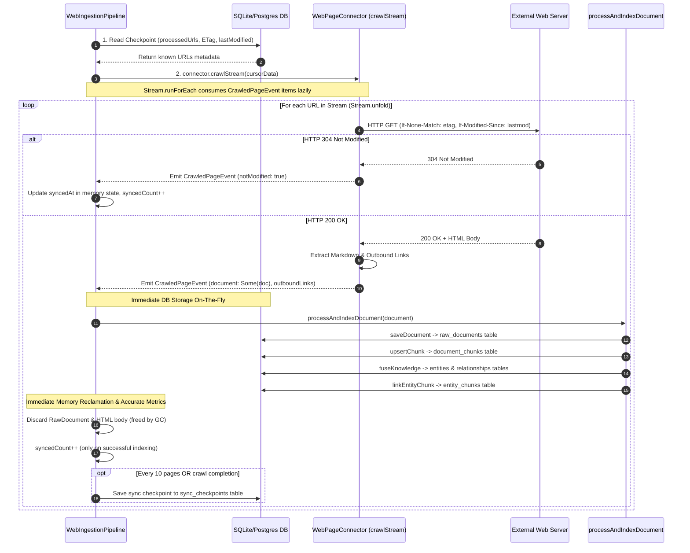

# Feature Implementation Walkthrough: On-The-Fly Web Ingestion & Minimal Memory Footprint

- **Feature ID / Slug**: `on-the-fly-web-ingestion`
- **Date**: 2026-09-11
- **Status**: Ready for Review <!-- Ready for Review | Approved -->

---

## 1. Executive Summary

We have redesigned the web ingestion subsystem to operate **on the fly** in a single streaming pass:
- **Immediate DB Persistence**: As each page is fetched and parsed into markdown, it is immediately processed (`processAndIndexDocument`), generating embeddings, extracting knowledge graph triples, and persisting directly into `raw_documents`, `document_chunks`, `entities`, `relationships`, and `entity_chunks`.
- **$O(1)$ Page Body Memory Footprint**: The HTML body and `RawDocument` strings are discarded from memory immediately after indexing, freeing memory to GC without lingering in any in-memory map or cache.
- **Check DB / Checkpoint First**: Before fetching a page body, the crawler checks `processedUrls` in the DB/checkpoint. It sends conditional headers (`If-None-Match`, `If-Modified-Since`) and natively handles HTTP `304 Not Modified`, skipping body downloads and indexing for fresh documents.
- **Progressive Checkpoints**: Saves sync checkpoints to `sync_checkpoints` periodically (every 10 documents) and at crawl completion, ensuring sync progress is retained even if interrupted.
- **Contract & Test Compatibility**: `WebPageConnector` continues to implement `SourceConnector` (`discover`, `fetch`) for tests and standalone consumption.

---

## 2. Changes Implemented

### File Modifications

| Action     | File Path                                                                 | Summary of Changes                                                                                                                                                                                                                 |
| :--------- | :------------------------------------------------------------------------ | :--------------------------------------------------------------------------------------------------------------------------------------------------------------------------------------------------------------------------------- |
| `[MODIFY]` | [`src/connectors/connector-base.ts`](../../src/connectors/connector-base.ts)     | Streamlined `WebProcessedUrlEntry` to contain only `etag`, `lastModified`, and `syncedAt` (removed redundant `url` and unused `contentHash`).                                                     |
| `[MODIFY]` | [`src/agents/types.ts`](../../src/agents/types.ts)                                 | Trimmed `WebProcessedUrlEntrySchema` to `etag`, `lastModified`, `syncedAt`; introduced `WebProcessedUrlStatusEntrySchema` for external status responses.                                         |
| `[MODIFY]` | [`src/connectors/web-connector.ts`](../../src/connectors/web-connector.ts)         | Added `crawlStream` exposing an Effect-native `Stream.Stream<CrawledPageEvent, ConnectorError>` for lazy page emission; eliminated `Effect.ignore` in `crawlOnTheFly` by using `Effect.matchEffect`; added `createSitemapStream` and `createSeedCrawlStream` helpers; removed full-body cache. |
| `[MODIFY]` | [`src/pipeline/web-ingestion-pipeline.ts`](../../src/pipeline/web-ingestion-pipeline.ts) | Rewired `runWebIngestion` to consume `connector.crawlStream(cursorData)` directly via `Stream.runForEach`, indexing documents to DB on the fly with progressive checkpointing every 10 documents; converted `processedUrls` and progress counters to pure Effect `HashMap` and `Ref` instances. |
| `[MODIFY]` | [`test/web-connector.test.ts`](../../test/web-connector.test.ts)                 | Added tests validating `crawlStream` with `Stream.runCollect`, accurate failure accounting in `crawlOnTheFly` without phantom synced increments, HTTP 304 conditional request skipping, and backward compatibility. |

### Key Architectural Flow



---

## 3. Verification & Validation Results

### 3.1 Code Formatting
Command: `npm run format:check`
```text
Checking formatting...
All matched files use Prettier code style!
```

### 3.2 Type Checking
Command: `npm run typecheck`
```text
> typecheck
> tsc --noEmit
(zero errors)
```

### 3.3 Linter Verification
Command: `npm run lint`
```text
> lint
> eslint src/ test/
(zero errors, zero warnings)
```

### 3.4 Automated Test Suite
Command: `npm test`
```text
ℹ tests 131
ℹ suites 48
ℹ pass 131
ℹ fail 0
ℹ cancelled 0
ℹ skipped 0
ℹ todo 0
```
Including tests:
- `should emit CrawledPageEvents via crawlStream and collect them via Stream.runCollect`
- `should account for page failures accurately in crawlOnTheFly without phantom synced increments`
- `should crawl on the fly emitting documents and extracting links without retaining bodies in cache`
- `should handle HTTP 304 Not Modified and skip document body processing when cursor is fresh`
- `should recursively crawl internal links from seedUrls matching includePatterns`

### 3.5 Golem WASM Component Build
Command: `npm run build`
```text
Selecting components
  Found components: golem-kgs-effect:effect-main
Building components
  Building golem-kgs-effect:effect-main
    ...
    Writing pre-initialized component ...
Done! Input: 13148.0 KB, Output: 40168.9 KB
Adding metadata to components
  Adding metadata to golem-kgs-effect:effect-main

Finished building [OK]
```

---

## 4. Conclusion

The on-the-fly web ingestion pipeline now uses an Effect-native `Stream.Stream` architecture:
1. `connector.crawlStream(...)` lazily unfolds pages without caching HTML bodies.
2. `Effect.ignore` has been completely eliminated; processing failures are accurately accounted for with no phantom sync counts.
3. Memory consumption remains $O(1)$ relative to page bodies.
4. All 131 test cases and `golem build` succeeded.
