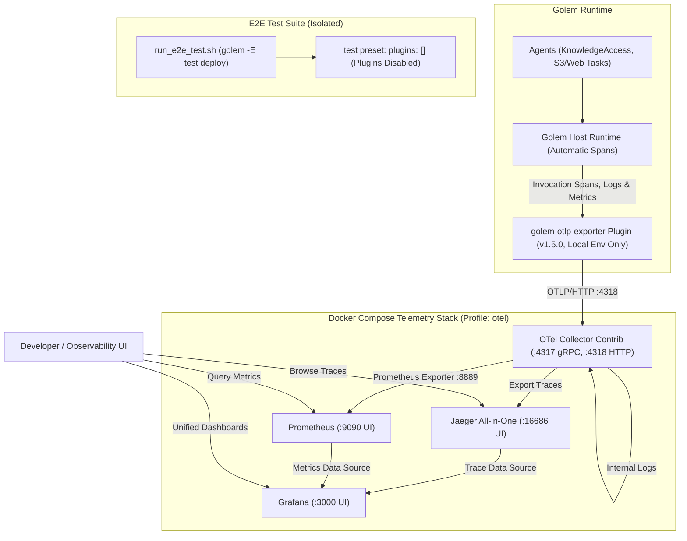

# Feature Plan: OpenTelemetry Integration & Observability Stack

- **Feature ID / Slug**: `opentelemetry-stack`
- **Date**: 2026-09-24
- **Status**: Completed <!-- Draft | Approved | In Progress | Completed -->

---

## 1. Overview & Goals

This feature introduces end-to-end OpenTelemetry (OTel) observability to the `golem-kgs-effect` knowledge graph application and local development environment:

1. **Docker Compose Observability Stack**:
   - Provide a complete, modern telemetry backend in Docker Compose comprising **OpenTelemetry Collector**, **Jaeger** (distributed tracing), **Prometheus** (metrics TSDB), and **Grafana** (unified dashboards & visualization).
   - Expose standard OTLP ingestion ports (`4318` HTTP, `4317` gRPC) alongside web visualization interfaces for Jaeger (`16686`), Prometheus (`9090`), and Grafana (`3000`).
   - Run under a dedicated profile (`profiles: ["otel"]`) or standalone `docker-compose.otel.yml` so it remains optional during standard development.

2. **Zero-Code Instrumentation (Automatic Spans)**:
   - Rely on Golem's built-in automatic instrumentation:
     - Golem automatically generates root invocation spans for every agent method call (via HTTP API, MCP, CLI, or RPC).
     - Golem automatically creates host operation spans (database queries, S3 calls, external HTTP calls).
     - Golem automatically captures `Effect.log*` messages and attaches trace & span IDs.
     - Golem automatically collects runtime metrics (`golem_invocation_count`, `golem_invocation_duration_ns`, memory, oplog lag).
   - **No modifications required in agent TypeScript source code** (`src/`).

3. **Golem Manifest Configuration (`golem.yaml`)**:
   - Enable Golem's native `golem-otlp-exporter` (version `1.5.0`) on the `effect-main` component for the `local` environment.
   - **E2E & Test Isolation**: Explicitly disable the plugin for the `test` preset using `pluginsMergeMode: replace` and `plugins: []`, ensuring E2E tests (`./run_e2e_test.sh` / `golem -E test deploy`) run cleanly without any OTLP collector dependency or telemetry overhead.
   - Support template substitution `{{ OTLP_ENDPOINT }}` with fallbacks in `secretDefaults` and `.env.example`.

---

## 2. Architecture & Technical Design

### Telemetry Architecture



### Telemetry Components & Port Allocation

| Component | Role | Host Ports | Default Access URL |
|---|---|---|---|
| **OTel Collector** | Receives OTLP telemetry from Golem, processes batches, routes to backends | `4317` (gRPC), `4318` (HTTP), `8889` (prom exporter) | `http://localhost:4318` |
| **Jaeger** | Trace storage, search, latency analysis, and waterfall visualization | `16686` (Web UI) | `http://localhost:16686` |
| **Prometheus** | Time-series database scraping runtime metrics from Collector | `9090` (Web UI) | `http://localhost:9090` |
| **Grafana** | Centralized dashboards pre-configured with Jaeger & Prometheus datasources | `3000` (Web UI) | `http://localhost:3000` (admin/admin or anon) |

---

## 3. File-by-File Changes

### 1. `docker-compose.yml` `[MODIFY]`
- Add services under `profiles: ["otel"]` on the existing `golem-kg-network`:
  - `otel-collector`: image `otel/opentelemetry-collector-contrib:latest`
  - `jaeger`: image `jaegertracing/all-in-one:latest`
  - `prometheus`: image `prom/prometheus:latest`
  - `grafana`: image `grafana/grafana:latest`
- Mount configuration files from `./telemetry/`.

### 2. `docker-compose.otel.yml` `[NEW]`
- Standalone docker-compose configuration for running or overriding telemetry independently:
  ```bash
  docker compose -f docker-compose.otel.yml up -d
  ```

### 3. `telemetry/otel-collector-config.yaml` `[NEW]`
- Configure OTel Collector:
  - **Receivers**: `otlp` (protocols: `http: 0.0.0.0:4318`, `grpc: 0.0.0.0:4317`)
  - **Processors**: `batch`, `memory_limiter`
  - **Exporters**:
    - `otlp/jaeger`: endpoint `jaeger:4317` (insecure)
    - `prometheus`: endpoint `0.0.0.0:8889`
    - `debug`: basic console logging for signals
  - **Pipelines**:
    - `traces`: receivers `[otlp]` -> processors `[memory_limiter, batch]` -> exporters `[otlp/jaeger, debug]`
    - `metrics`: receivers `[otlp]` -> processors `[memory_limiter, batch]` -> exporters `[prometheus]`
    - `logs`: receivers `[otlp]` -> processors `[memory_limiter, batch]` -> exporters `[debug]`

### 4. `telemetry/prometheus.yml` `[NEW]`
- Prometheus configuration with scrape config targeting `otel-collector:8889`.

### 5. `telemetry/grafana/provisioning/datasources/datasources.yaml` `[NEW]`
- Provision default Prometheus and Jaeger datasources in Grafana for instant zero-configuration trace and metric exploration.

### 6. `golem.yaml` `[MODIFY]`
- Add `plugins` to `components.golem-kgs-effect:effect-main`:
  ```yaml
  plugins:
    - name: golem-otlp-exporter
      version: "1.5.0"
      parameters:
        endpoint: "{{ OTLP_ENDPOINT }}"
        signals: "traces,logs,metrics"
        service-name-mode: "agent-type"
  ```
- In `components.golem-kgs-effect:effect-main.presets.test`:
  ```yaml
  presets:
    test:
      pluginsMergeMode: replace
      plugins: []  # Disables OTLP plugin during E2E tests
      config:
        ...
  ```
- Add `OTLP_ENDPOINT: "{{ OTLP_ENDPOINT }}"` with default `http://localhost:4318` under `secretDefaults.local`, and omit/empty under `secretDefaults.test`.

### 7. `.env.example` and `.env` `[MODIFY]`
- Add:
  ```env
  OTLP_ENDPOINT=http://localhost:4318
  OTLP_PORT=4318
  JAEGER_PORT=16686
  PROMETHEUS_PORT=9090
  GRAFANA_PORT=3000
  ```

---

## 4. Verification Plan

### Automated Verification
1. **Formatting & Linting**:
   ```bash
   npm run format:check
   npm run lint
   ```
2. **Type Checking**:
   ```bash
   npm run typecheck
   ```
3. **Golem Component Build**:
   ```bash
   npm run build
   ```
4. **Unit & Integration Tests**:
   ```bash
   npm test
   ```
5. **End-to-End Tests**:
   ```bash
   ./run_e2e_test.sh
   ```
   *Verify that E2E tests pass completely with the OTLP plugin cleanly disabled via the `test` preset.*

### Observability Stack Verification
1. Start telemetry stack in Docker Compose:
   ```bash
   docker compose --profile otel up -d
   ```
2. Check health of services:
   - OTel Collector: `curl -I http://localhost:4318`
   - Jaeger UI: `curl -I http://localhost:16686`
   - Prometheus UI: `curl -I http://localhost:9090/-/healthy`
   - Grafana UI: `curl -I http://localhost:3000/api/health`
3. Deploy agent in local environment:
   ```bash
   golem deploy --yes
   ```
4. Invoke an agent method (e.g., query overview or search) and verify:
   - Root invocation trace appears in Jaeger UI (`http://localhost:16686`).
   - Host operation spans and correlated logs are visible in the trace waterfall.
   - Invocation metrics appear in Prometheus (`http://localhost:9090`).
