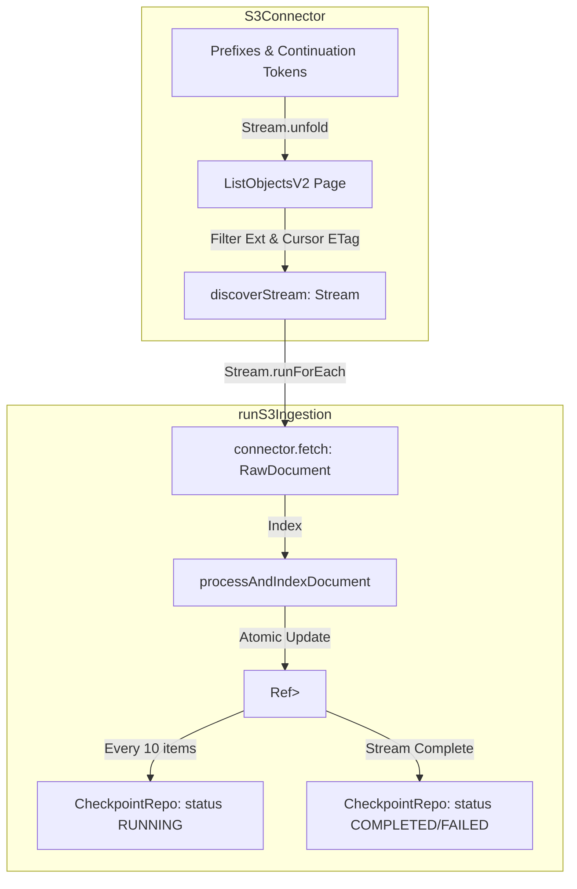

# Feature Plan: S3 Stream Ingestion and Progressive Checkpointing

- **Feature ID / Slug**: `s3-stream-ingestion-and-checkpointing`
- **Date**: 2026-09-11
- **Status**: Completed <!-- Draft | Approved | In Progress | Completed -->

---

## 1. Overview & Goals

Currently, the S3 connector and ingestion pipeline ([`src/pipeline/s3-ingestion-pipeline.ts`](file:///Users/coon/workspace-zv/git/golem-kgs-effect/src/pipeline/s3-ingestion-pipeline.ts)) load all discovered S3 objects eagerly into an in-memory array (`connector.discover`) before sequentially processing them via an imperative `for...of` loop with mutable state closures (`newProcessedKeys: Record<string, string>`, `let syncedCount = 0`). Furthermore, checkpointing to SQLite (`sync_checkpoints`) is **only executed once at the very end** of the batch.

If an ingestion job on a bucket with 1,000 objects fails or is interrupted at object 950, all 950 processed items lose their checkpoint status and must be re-evaluated on the next run. In addition, buffering all discovered object metadata in memory does not scale for large buckets.

This feature brings the S3 ingestion pipeline to full architectural parity with the Web ingestion pipeline:
1. **Streaming Object Discovery**: Implement `discoverStream(cursor)` in `S3Connector` to lazily stream `DiscoveredItem`s page-by-page across S3 `ListObjectsV2` continuation tokens.
2. **Stream Pipeline Execution**: Refactor `runS3Ingestion` to consume `discoverStream` using `Stream.runForEach`, fetching and indexing documents on the fly with constant $O(1)$ memory usage.
3. **Pure Concurrency & State**: Replace mutable JavaScript variables with Effect's `Ref` and `HashMap` (`HashMap.HashMap<string, string>`).
4. **Progressive Checkpointing**: Persist durable checkpoints with status `"RUNNING"` to `sync_checkpoints` every 10 documents, followed by the final `"COMPLETED"` or `"FAILED"` checkpoint at stream termination.

### Goals

- Stream S3 object discovery page-by-page using Effect's `Stream` instead of eager array buffering.
- Provide progressive checkpointing every 10 documents with status `"RUNNING"` in `sync_checkpoints`.
- Isolate per-item fetch and indexing failures so that a single corrupted or missing object increments the failure count without aborting the stream.
- Use idiomatic Effect state management (`Ref` and `HashMap`).
- Maintain 100% backward compatibility for `SourceConnector` contracts and existing test suites (`S3ConnectorService.Mock`).

### Non-Goals

- Modifying the underlying AWS S3 Signature Version 4 implementation in `s3-signer.ts` (it works as expected).
- Changing the S3 configuration schema in `schema.ts`.

---

## 2. Architecture & Technical Design



### Key Decisions

1. **Stream Discovery (`discoverStream`) vs Eager Discovery (`discover`)**:
   - `S3Connector.discoverStream(cursor)` emits `DiscoveredItem`s as XML pages are fetched and parsed from S3.
   - `S3Connector.discover(cursor)` delegates directly to `Stream.runCollect(this.discoverStream(cursor)).pipe(Effect.map(Chunk.toReadonlyArray))`, eliminating duplicate logic.
2. **Per-Item Error Containment**:
   - `fetch(item)` and `processAndIndexDocument(document)` are wrapped inside `Effect.catch` inside `Stream.runForEach`. A single document failure increments `failedCountRef` while keeping the discovery stream alive.
3. **Atomic State & Progressive Checkpointing**:
   - `processedRef` is initialized from `currentState.processedKeys` using `HashMap.fromIterable`.
   - Every 10 successfully synced items, a checkpoint is saved with `status: "RUNNING"`, matching the pattern established in the Web pipeline.
   - On completion, `finalProcessedKeys` is converted via `Object.fromEntries(finalProcessedMap)` and saved with status `"COMPLETED"` or `"FAILED"`.
4. **Mock Compatibility**:
   - `S3ConnectorService.Mock` implements `discoverStream` as `Stream.fromIterableEffect(this.discover(cursor))`.

---

## 3. Proposed Changes & File Impact

| Action     | File Path                                                                                                    | Description                                                                                                                                                   |
| :--------- | :----------------------------------------------------------------------------------------------------------- | :------------------------------------------------------------------------------------------------------------------------------------------------------------ |
| `[MODIFY]` | [`src/connectors/s3-connector.ts`](file:///Users/coon/workspace-zv/git/golem-kgs-effect/src/connectors/s3-connector.ts)           | Add `discoverStream(cursor)` with paginated streaming, make `discover` delegate to `discoverStream`, and add `discoverStream` to `S3ConnectorService.Mock`. |
| `[MODIFY]` | [`src/pipeline/s3-ingestion-pipeline.ts`](file:///Users/coon/workspace-zv/git/golem-kgs-effect/src/pipeline/s3-ingestion-pipeline.ts) | Rewrite `runS3Ingestion` with `Stream.runForEach`, `Ref`, `HashMap`, and progressive checkpointing every 10 documents.                                       |
| `[MODIFY]` | [`test/connectors.test.ts`](file:///Users/coon/workspace-zv/git/golem-kgs-effect/test/connectors.test.ts)                   | Add tests for `discoverStream` and streaming pagination in `S3Connector`.                                                                                     |
| `[MODIFY]` | [`test/pipeline.test.ts`](file:///Users/coon/workspace-zv/git/golem-kgs-effect/test/pipeline.test.ts)                       | Add tests verifying progressive checkpointing during S3 ingestion.                                                                                           |

---

## 4. Verification Plan

### Automated Checks

1. **Code Formatting**:
   ```bash
   npm run format:check
   ```
2. **Type Checking**:
   ```bash
   npm run typecheck
   ```
3. **Linter Verification**:
   ```bash
   npm run lint
   ```
4. **Automated Tests**:
   ```bash
   npm test
   ```
5. **Golem Component Build**:
   ```bash
   npm run build
   ```

### Manual / Pipeline Verification

- Verify that `test/agents.test.ts` passes all existing S3 ingestion tests (initial run, incremental skip, force rescan).
- Verify that intermediate `"RUNNING"` checkpoints are emitted and persisted when processing $>10$ items.

---

## 5. Risks & Open Questions

- **Risks**: None identified. S3 pagination semantics remain identical, but stream-driven and non-blocking.
- **Open Questions**: None. The design directly mirrors the approved Web ingestion stream architecture.
