# Feature Plan: Scoped Connector Configuration Rework

- **Feature ID / Slug**: `scoped-connector-config-rework`
- **Date**: 2026-09-24
- **Status**: Completed <!-- Draft | Approved | In Progress | Completed -->

---

## 1. Overview & Goals

Currently, when creating connector layers for single-source task agents (`S3IngestorTaskAgent({ resourceName })` and `WebIngestorTaskAgent({ resourceName })`), [`makeS3ConnectorLayer`](file:///Users/coon/workspace-zv/git/golem-kgs-effect/src/agents/connector-layers.ts#L19-L49) extracts and validates the exact `S3ResourceTarget` from secrets. However, because `S3ConnectorService.Live` historically depended on `S3ResourcesConfig` (a multi-resource registry map with `getS3Resource(name)`), the factory constructs a synthetic 1-element map:

```typescript
const scopedTargets = { [resourceName]: target };
const s3ConfigLayer = Layer.succeed(S3ResourcesConfig, {
  s3: scopedTargets,
  getS3Resource: (name: string) =>
    name === resourceName ? Option.some(target) : Option.none(),
});
```

And inside `S3ConnectorService.Live`, `createConnector(targetOrName)` redundantly calls:

```typescript
const resOpt = resourcesConfig.getS3Resource(targetOrName);
```

The same artificial dictionary indirection exists in `WebConnectorService.Live` with `WebResourcesConfig`.

Furthermore, wrapping the connector in an artificial factory service (`s3Service.createConnector(resourceName)`) adds unnecessary indirection when the scoped layer is already built for that exact agent and resource.

This feature reworks the connector architecture to:

1. **Directly inject the specific resource's configuration (`S3ResourceConfig` / `WebResourceConfig`)**, eliminating synthetic maps and fake getter closures.
2. **Promote the Connector directly as the Service**: `yield* S3ConnectorService` directly yields the `S3ConnectorInstance`, eliminating the redundant `createConnector()` factory wrapper.

### Goals

1. **Direct Scoped Configuration**: Define `S3ResourceConfig` and `WebResourceConfig` service tags in [`src/config/schema.ts`](file:///Users/coon/workspace-zv/git/golem-kgs-effect/src/config/schema.ts) representing a single, specific resource target.
2. **Direct Connector as Service Tag**:
   - `S3ConnectorService` extends `Context.Service<S3ConnectorService, S3ConnectorInstance>()`.
   - `WebConnectorService` extends `Context.Service<WebConnectorService, WebPageConnector>()`.
   - `S3ConnectorService.Live` yields `S3ResourceConfig` + `HttpClient` and returns `new S3Connector({ target, prefixes: target.prefixes }, httpClient)`.
   - `WebConnectorService.Live` yields `WebResourceConfig` + `HttpClient` and returns `yield* WebPageConnector.make(target, httpClient)`.
3. **Eliminate Synthetic Mocks in Layer Factories**:
   - `makeS3ConnectorLayer` provides `Layer.succeed(S3ResourceConfig, target)` to `S3ConnectorService.Live`.
   - `makeWebConnectorLayer` provides `Layer.succeed(WebResourceConfig, target)` to `WebConnectorService.Live`.
4. **Simplify Ingestion Pipelines**:
   - In `s3-ingestion-pipeline.ts`: replace `const s3Service = yield* S3ConnectorService; const connector = yield* s3Service.createConnector(...)` with `const connector = yield* S3ConnectorService`.
   - In `web-ingestion-pipeline.ts`: replace `const webService = yield* WebConnectorService; const connector = yield* webService.createConnector(...)` with `const connector = yield* WebConnectorService`.
5. **Update Tests & Documentation**:
   - Update `test/connectors.test.ts` and `test/agents.test.ts` to consume connector instances directly from service tags.
   - **Update `blogpost.md`**: Update Section 3.1 ("Least-Privilege Scoped Connector Layers") and Code Snippet 2 to illustrate the direct `S3ResourceConfig` layer injection and how pipelines consume connectors directly with zero boilerplate.
   - **Preserve `README.md`**: Keep `README.md` focused as an operational guide without low-level internal layer wiring code or redundant subheadings.
6. **Pass All Validation**:
   - Ensure formatting, typecheck, lint, unit tests, Golem build, and E2E tests pass with 0 errors.

### Non-Goals

- Changing the underlying connector streaming logic (`S3Connector.discoverStream`, `WebPageConnector.discover`).
- Modifying how secrets are stored in Golem (`resources.s3` and `resources.web` schemas in `schema.ts`).
- Removing `S3ResourcesConfig` / `WebResourcesConfig` completely (they remain available for multi-resource administrative utilities if needed).

---

## 2. Architecture & Technical Design

### Before vs. After Flow

```mermaid
flowchart TD
    subgraph Before["Current Architecture (Indirection & Double Lookup)"]
        B1["makeS3ConnectorLayer(config, main)"] -->|Resolves target| B2["Dummy Record<br/>{ main: target }"]
        B2 -->|Dummy getS3Resource| B3["S3ResourcesConfig Layer"]
        B3 -->|Provides to| B4["S3ConnectorService Factory"]
        B4 -->|"createConnector(main)"| B5["resourcesConfig.getS3Resource(main)"]
        B5 -->|Creates| B6["S3Connector({ target })"]
    end

    subgraph After["Proposed Architecture (Direct Connector as Service)"]
        A1["makeS3ConnectorLayer(config, main)"] -->|Resolves target| A2["S3ResourceConfig Layer<br/>(Target directly)"]
        A2 -->|Provides to| A3["S3ConnectorService.Live"]
        A3 -->|"yield* S3ConnectorService"| A4["S3ConnectorInstance"]
    end
```



### Detailed Design

#### 1. Context Tags in `src/config/schema.ts`

```typescript
/**
 * Scoped service tag representing a single, specific S3 resource target configuration.
 */
export class S3ResourceConfig extends Context.Service<
  S3ResourceConfig,
  S3ResourceTarget
>()("app/config/S3ResourceConfig") {}

/**
 * Scoped service tag representing a single, specific Web resource target configuration.
 */
export class WebResourceConfig extends Context.Service<
  WebResourceConfig,
  WebResourceTarget
>()("app/config/WebResourceConfig") {}
```

#### 2. Direct Service Tag & Live Implementation in `src/connectors/s3-connector.ts`

```typescript
export class S3ConnectorService extends Context.Service<
  S3ConnectorService,
  S3ConnectorInstance
>()("app/connectors/S3ConnectorService") {
  static readonly Live = Layer.effect(
    S3ConnectorService,
    Effect.gen(function* () {
      const httpClient = yield* HttpClient.HttpClient;
      const target = yield* S3ResourceConfig;

      return new S3Connector(
        { target, prefixes: target.prefixes },
        httpClient,
      );
    }),
  );

  static readonly Mock = (
    mockFiles: Record<string, { readonly content: string; readonly lastModified?: Date; readonly etag?: string }> = {},
    resourceName: string = "main",
  ) =>
    Layer.succeed(S3ConnectorService, S3ConnectorService.makeMock(mockFiles, resourceName));
```

#### 3. Direct Service Tag & Live Implementation in `src/connectors/web-connector.ts`

```typescript
export class WebConnectorService extends Context.Service<
  WebConnectorService,
  WebPageConnector
>()("app/connectors/WebConnectorService") {
  static readonly Live = Layer.effect(
    WebConnectorService,
    Effect.gen(function* () {
      const httpClient = yield* HttpClient.HttpClient;
      const target = yield* WebResourceConfig;

      return yield* WebPageConnector.make(target, httpClient);
    }),
  );
```

#### 4. Clean Layer Factories in `src/agents/connector-layers.ts`

```typescript
export const makeS3ConnectorLayer = (
  config: AppAgentConfigService,
  resourceName: string,
) =>
  Effect.gen(function* () {
    const resourcesVal = Redacted.value(yield* config.resources.s3.get);
    const s3Targets = parseS3Targets(resourcesVal);
    const target = s3Targets[resourceName];

    if (!target) {
      return yield* Effect.fail(
        new ConnectorError({
          connectorId: `s3_${resourceName}`,
          message: `S3 resource target '${resourceName}' is not configured in secrets`,
        }),
      );
    }

    return S3ConnectorService.Live.pipe(
      Layer.provide(Layer.succeed(S3ResourceConfig, target)),
      Layer.provide(FetchHttpClient.layer),
    );
  });

export const makeWebConnectorLayer = (
  config: AppAgentConfigService,
  resourceName: string,
) =>
  Effect.gen(function* () {
    const resourcesVal = Redacted.value(yield* config.resources.web.get);
    const webTargets = parseWebTargets(resourcesVal);
    const target = webTargets[resourceName];

    if (!target) {
      return yield* Effect.fail(
        new ConnectorError({
          connectorId: `web:${resourceName}`,
          message: `Web resource target '${resourceName}' is not configured in secrets`,
        }),
      );
    }

    return WebConnectorService.Live.pipe(
      Layer.provide(Layer.succeed(WebResourceConfig, target)),
      Layer.provide(FetchHttpClient.layer),
    );
  });
```

#### 5. Clean Caller Usage in Pipelines

In `src/pipeline/s3-ingestion-pipeline.ts`:

```typescript
// Directly obtain the scoped connector instance from the environment
const connector = yield * S3ConnectorService;
```

In `src/pipeline/web-ingestion-pipeline.ts`:

```typescript
// Directly obtain the scoped connector instance from the environment
const connector = yield * WebConnectorService;
```

---

## 3. File-by-File Changes

| Operation  | File                                                                                                                                    | Description                                                                                                                                                 |
| :--------- | :-------------------------------------------------------------------------------------------------------------------------------------- | :---------------------------------------------------------------------------------------------------------------------------------------------------------- |
| `[MODIFY]` | [`src/config/schema.ts`](file:///Users/coon/workspace-zv/git/golem-kgs-effect/src/config/schema.ts)                                     | Export `S3ResourceConfig` and `WebResourceConfig` service tags.                                                                                             |
| `[MODIFY]` | [`src/agents/connector-layers.ts`](file:///Users/coon/workspace-zv/git/golem-kgs-effect/src/agents/connector-layers.ts)                 | Eliminate dummy `{ [name]: target }` maps and fake `getS3Resource`/`getWebResource` functions; provide `S3ResourceConfig` and `WebResourceConfig` directly. |
| `[MODIFY]` | [`src/connectors/s3-connector.ts`](file:///Users/coon/workspace-zv/git/golem-kgs-effect/src/connectors/s3-connector.ts)                 | `S3ConnectorService` extends `S3ConnectorInstance`; `Live` directly constructs `S3Connector` from `S3ResourceConfig`.                                       |
| `[MODIFY]` | [`src/connectors/web-connector.ts`](file:///Users/coon/workspace-zv/git/golem-kgs-effect/src/connectors/web-connector.ts)               | `WebConnectorService` extends `WebPageConnector`; `Live` directly constructs connector from `WebResourceConfig`.                                            |
| `[MODIFY]` | [`src/pipeline/s3-ingestion-pipeline.ts`](file:///Users/coon/workspace-zv/git/golem-kgs-effect/src/pipeline/s3-ingestion-pipeline.ts)   | Consume `const connector = yield* S3ConnectorService` directly.                                                                                             |
| `[MODIFY]` | [`src/pipeline/web-ingestion-pipeline.ts`](file:///Users/coon/workspace-zv/git/golem-kgs-effect/src/pipeline/web-ingestion-pipeline.ts) | Consume `const connector = yield* WebConnectorService` directly.                                                                                            |
| `[MODIFY]` | [`test/connectors.test.ts`](file:///Users/coon/workspace-zv/git/golem-kgs-effect/test/connectors.test.ts)                               | Update connector tests to consume connector instance directly from service tag.                                                                             |
| `[MODIFY]` | [`test/agents.test.ts`](file:///Users/coon/workspace-zv/git/golem-kgs-effect/test/agents.test.ts)                                       | Update layer verification tests to verify connector instance directly on `S3ConnectorService` / `WebConnectorService`.                                      |
| `[MODIFY]` | [`blogpost.md`](file:///Users/coon/workspace-zv/git/golem-kgs-effect/blogpost.md)                                                       | Update Section 3.1 and Code Snippet 2 to illustrate clean `S3ResourceConfig` layer injection and direct connector consumption.                              |

---

## 4. Verification Plan

### Automated Checks

1. **Formatting**:
   ```bash
   npm run format:check
   ```
2. **Type Checking**:
   ```bash
   npm run typecheck
   ```
3. **Linter**:
   ```bash
   npm run lint
   ```
4. **Unit & Integration Tests**:
   ```bash
   npm test
   ```
   Must pass all 49 test suites / 143+ unit tests.
5. **Golem WASM Build**:
   ```bash
   npm run build
   ```
   Must compile cleanly into WebAssembly component.
6. **E2E Integration Test Suite**:
   ```bash
   ./run_e2e_test.sh
   ```
   Verifies full multi-agent pipeline against live local Golem server.

---

## 5. Documentation Updates Plan

### `blogpost.md`

- In **Section 3.1: Least-Privilege Scoped Connector Layers**:
  - Update the prose to explain how each worker fiber is provided with its specific `S3ResourceConfig` / `WebResourceConfig`.
  - Replace Snippet 2 with the updated, elegant `makeS3ConnectorLayer` that provides `Layer.succeed(S3ResourceConfig, target)` directly to `S3ConnectorService.Live`.
  - Show the simplified 1-line pipeline retrieval: `const connector = yield* S3ConnectorService;`.

### `README.md`

- Preserved as a clean, high-level operational guide without internal connector layer code snippets or unnecessary subsections.
