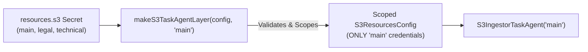

# Feature Plan: Scoped Resource Connector Layers

- **Feature ID / Slug**: `scoped-resource-connector-layers`
- **Date**: 2026-09-22
- **Status**: Draft <!-- Draft | Approved | In Progress | Completed -->

---

## 1. Overview & Goals

Currently, `makeS3ConnectorLayer` and `makeWebConnectorLayer` in `src/agents/agent-pipeline-layer.ts` populate `S3ResourcesConfig` and `WebResourcesConfig` with *all* configured resources from the secret store.

However, each `S3IngestorTaskAgent` and `WebIngestorTaskAgent` is an autonomous worker bound 1:1 to a specific `resourceName` (e.g. `resourceName: "main"`). Providing all targets to each agent worker exposes credentials (`accessKeyId`, `secretAccessKey`, private auth headers) of unrelated resources to that worker. Furthermore, if a worker is instantiated with a non-existent or misspelled resource name, initialization silently succeeds and failures only occur later when `sync()` is triggered.

This feature refactors the connector layer factories to **strictly require** `resourceName: string`. The layer validates that the target exists (failing fast with `ConnectorError` if absent), constructs an `S3ResourcesConfig` or `WebResourcesConfig` containing *only* that target, and removes the dead, unused `makeAgentPipelineLayer` helper.

### Goals

- Strictly require `resourceName: string` in `makeS3ConnectorLayer(config, resourceName)` and `makeWebConnectorLayer(config, resourceName)`.
- Strictly require `resourceName: string` in `makeS3TaskAgentLayer(config, resourceName)` and `makeWebTaskAgentLayer(config, resourceName)`.
- Validate that the target exists, failing fast at layer initialization with a typed `ConnectorError` if not configured.
- Scope `S3ResourcesConfig` and `WebResourcesConfig` so that only the specified target is available in the layer.
- Update `S3IngestorTaskAgent` and `WebIngestorTaskAgent` to pass `resourceName` from constructor parameters.
- Remove the unused legacy helper `makeAgentPipelineLayer` from `src/agents/agent-pipeline-layer.ts`.
- Add unit tests verifying credential isolation and fail-fast behavior on missing resource targets.

### Non-Goals

- Changing the `S3ConnectorService` or `WebConnectorService` interface.
- Modifying how secrets are stored in Golem (`resources.s3` and `resources.web` remain unchanged).

---

## 2. Architecture & Technical Design

### Strict Credential Isolation



1. **Strict Resource Validation & Scoping**:
   When `makeS3ConnectorLayer(config, resourceName)` executes:
   - Fetches and decodes `resources.s3`.
   - Checks if `s3Targets[resourceName]` exists.
   - If missing: yields `Effect.fail(new ConnectorError({ connectorId: "s3_" + resourceName, message: "S3 resource target '" + resourceName + "' is not configured in secrets" }))`.
   - If present: creates `S3ResourcesConfig` with `{ [resourceName]: target }` and `getS3Resource: (name) => name === resourceName ? Option.some(target) : Option.none()`.
2. **Web Parallel**:
   - `makeWebConnectorLayer(config, resourceName)` performs the exact same isolation and validation for `resources.web`.
3. **Dead Code Removal**:
   - `makeAgentPipelineLayer` is completely unused across the entire codebase and will be removed to enforce that all connector layer creation is resource-scoped.

---

## 3. Proposed Changes & File Impact

| Action     | File Path                                                                                | Description                                                                                                    |
| :--------- | :--------------------------------------------------------------------------------------- | :------------------------------------------------------------------------------------------------------------- |
| `[MODIFY]` | [`src/agents/agent-pipeline-layer.ts`](../../src/agents/agent-pipeline-layer.ts)         | Require `resourceName: string` in `makeS3ConnectorLayer`, `makeWebConnectorLayer`, `makeS3TaskAgentLayer`, and `makeWebTaskAgentLayer`. Remove unused `makeAgentPipelineLayer`. |
| `[MODIFY]` | [`src/agents/s3-task-agent.ts`](../../src/agents/s3-task-agent.ts)                       | Pass constructor `resourceName` to `makeS3TaskAgentLayer(config, resourceName)`.                               |
| `[MODIFY]` | [`src/agents/web-task-agent.ts`](../../src/agents/web-task-agent.ts)                     | Pass constructor `resourceName` to `makeWebTaskAgentLayer(config, resourceName)`.                              |
| `[MODIFY]` | [`test/agents.test.ts`](../../test/agents.test.ts)                                       | Add unit tests verifying credential isolation and fail-fast behavior on missing resource targets.             |

### Detailed Changes

#### `src/agents/agent-pipeline-layer.ts`
- Update `makeS3ConnectorLayer`:
  ```typescript
  export const makeS3ConnectorLayer = (
    config: AppAgentConfigService,
    resourceName: string,
  ) =>
    Effect.gen(function* () {
      const resourcesVal = Redacted.value(yield* config.resources.s3.get);
      const s3Targets = parseS3Targets(resourcesVal);
      const target = s3Targets[resourceName];

      if (!target) {
        return yield* Effect.fail(
          new ConnectorError({
            connectorId: `s3_${resourceName}`,
            message: `S3 resource target '${resourceName}' is not configured in secrets`,
          }),
        );
      }

      const scopedTargets = { [resourceName]: target };
      const s3ConfigLayer = Layer.succeed(S3ResourcesConfig, {
        s3: scopedTargets,
        getS3Resource: (name: string) =>
          name === resourceName ? Option.some(target) : Option.none(),
      });

      const httpLayer = FetchHttpClient.layer;
      return S3ConnectorService.Live.pipe(
        Layer.provide(s3ConfigLayer),
        Layer.provide(httpLayer),
      );
    });
  ```
- Apply matching logic to `makeWebConnectorLayer(config: AppAgentConfigService, resourceName: string)`.
- Update `makeS3TaskAgentLayer(config: AppAgentConfigService, resourceName: string)` to pass `resourceName`.
- Update `makeWebTaskAgentLayer(config: AppAgentConfigService, resourceName: string)` to pass `resourceName`.
- Remove `makeAgentPipelineLayer`.

#### `src/agents/s3-task-agent.ts` & `src/agents/web-task-agent.ts`
- Pass `resourceName` into the layer factory call:
  ```typescript
  const pipelineLayer = yield* makeS3TaskAgentLayer(config, resourceName);
  ```
  and
  ```typescript
  const pipelineLayer = yield* makeWebTaskAgentLayer(config, resourceName);
  ```

#### `test/agents.test.ts`
- Add tests to verify:
  1. `makeS3ConnectorLayer(config, "main")` succeeds and isolates only `"main"`.
  2. `makeS3ConnectorLayer(config, "non-existent")` fails fast with `ConnectorError`.
  3. `makeWebConnectorLayer(config, "golem-docs")` succeeds and isolates only `"golem-docs"`.
  4. `makeWebConnectorLayer(config, "non-existent")` fails fast with `ConnectorError`.

---

## 4. Verification Plan

### Automated Checks

- **Code Formatting**:
  ```bash
  npm run format:check
  ```
- **Type Checking**:
  ```bash
  npm run typecheck
  ```
- **Linter**:
  ```bash
  npm run lint
  ```
- **Unit & Integration Tests**:
  ```bash
  npm test
  ```
- **Golem WASM Build**:
  ```bash
  npm run build
  ```
