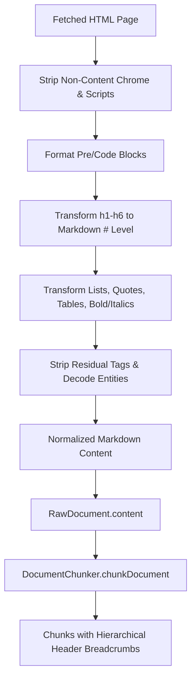

# Feature Plan: Web Connector HTML to Markdown Transformation

- **Feature ID / Slug**: `web-connector-html-to-markdown`
- **Date**: 2026-09-11
- **Status**: Completed <!-- Draft | Approved | In Progress | Completed -->

---

## 1. Overview & Goals

The `WebPageConnector` currently extracts page content using `extractTextFromHtml`, which strips all HTML tags and flattens headings (`<h1>` through `<h6>`) into plain text without markdown heading prefixes. 

Meanwhile, downstream in the ingestion pipeline, `DocumentChunker` (`src/pipeline/chunker.ts`) relies on `parseMarkdownSections` to build hierarchical `headerBreadcrumb` trails (e.g., `Parent Section > Sub Section`). Because web documents currently contain flat text without markdown headers, all web-ingested chunks lose semantic hierarchy and produce empty header breadcrumbs.

### Goals
1. Transform HTML content in `WebPageConnector` into clean, semantic Markdown rather than flat text.
2. Preserve heading hierarchies (`#`, `##`, `###`, etc.) so that `DocumentChunker` automatically populates `headerBreadcrumb`s.
3. Preserve formatting semantics that aid LLM graph extraction:
   - Bullet lists (`- ...`) and numbered lists
   - Code blocks (` ``` `) and inline code (`` `code` ``)
   - Blockquotes (`> ...`)
   - Bold and italic emphasis (`**bold**`, `*italic*`)
   - Simple table rows into Markdown tables (`| ... |`)
   - Meaningful hyperlinks (`[text](url)`)
4. Maintain 100% compatibility with Golem's QuickJS WebAssembly runtime: zero DOM dependencies (no `jsdom` or browser globals), zero extra heavyweight dependencies, fast regex/lexer execution.
5. Maintain backward compatibility for existing callers of `extractTextFromHtml` and `extractContent`.

### Non-Goals
- Full browser rendering or DOM tree emulation (QuickJS WASM environment constraint).
- Retaining binary media or inline images in markdown text (avoids token bloat).

---

## 2. Architecture & Technical Design

### Processing Pipeline Flow



### Key Decisions

1. **Pure Regex/String Transformer vs. External Library**:
   - *Decision*: Enhance `extractTextFromHtml` and export `extractMarkdownFromHtml` directly within `src/connectors/web-connector.ts` using structured regex substitutions and entity decoders.
   - *Rationale*: Zero runtime dependencies, zero risk to the Rollup/WASM build, predictable behavior, and strict control over token efficiency (e.g., dropping noisy navigation and long tracking URLs).

2. **Backward Compatibility**:
   - *Decision*: Keep `extractTextFromHtml` as an exported function that points to `extractMarkdownFromHtml` (or alias it), keeping `extractContent` return types stable while providing semantic markdown.
   - *Rationale*: Existing tests and consumers of `extractContent` (such as `WebPageConnector.processUrl`) continue to work seamlessly without breaking type signatures.

3. **Breadcrumb Verification with `DocumentChunker`**:
   - *Decision*: Add a test in `test/web-connector.test.ts` verifying that HTML parsed by the web connector produces valid breadcrumb trails when chunked by `DocumentChunker`.

---

## 3. Proposed Changes & File Impact

| Action     | File Path                                          | Description                                                                                     |
| :--------- | :------------------------------------------------- | :---------------------------------------------------------------------------------------------- |
| `[MODIFY]` | [`src/connectors/web-connector.ts`](../../src/connectors/web-connector.ts) | Implement `extractMarkdownFromHtml`, upgrade tag transformations (headings, code, lists, tables, formatting), update `extractContent`. |
| `[MODIFY]` | [`test/web-connector.test.ts`](../../test/web-connector.test.ts)           | Add test cases for markdown extraction (headings, code, lists, tables) and verify chunker breadcrumb generation. |

### Detailed Changes

#### `src/connectors/web-connector.ts`
- Implement `extractMarkdownFromHtml(body: string): string`:
  - Strip `<script>`, `<style>`, `<noscript>`, `<iframe>`, comments.
  - Strip layout chrome: `<header>`, `<footer>`, `<nav>`, `<aside>`, `<button>`, `<form>`, `<svg>`, `role="navigation"`, etc.
  - Convert `<pre><code...>(.*?)</code></pre>` into ```` ```\n$1\n``` ```` and `<code>(.*?)</code>` into `` `$1` ``.
  - Convert `<h([1-6])\b[^>]*>(.*?)</h\1>` into `${'#'.repeat(level)} ${heading}`.
  - Convert `<blockquote\b[^>]*>(.*?)</blockquote>` into `> $1`.
  - Convert `<li\b[^>]*>(.*?)</li>` into `- $1\n`.
  - Convert simple table rows (`<tr>`, `<th>`, `<td>`) into markdown tables.
  - Convert `<strong>`, `<b>` into `**...**` and `<em>`, `<i>` into `*...*`.
  - Strip residual tags and decode HTML entities.
  - Normalize whitespace while preserving markdown structure (blank lines between paragraphs and headings).
- Maintain `extractTextFromHtml` alias pointing to `extractMarkdownFromHtml`.

#### `test/web-connector.test.ts`
- Add unit tests for `extractMarkdownFromHtml`:
  - Verify `#`, `##`, `###` headings are properly formed.
  - Verify code blocks, inline code, and lists are formatted as markdown.
  - Verify bold and italic styles are preserved.
  - Verify chrome (scripts, styles, headers, footers, navs) is cleanly removed.
- Add integration test with `DocumentChunker`:
  - Pass the extracted markdown to `DocumentChunker.chunkText`.
  - Verify `headerBreadcrumb` fields are accurately populated from the HTML headings.

---

## 4. Verification Plan

### Automated Checks
- **Code Formatting**:
  ```bash
  npm run format:check
  npm run format
  ```
- **Type Checking**:
  ```bash
  npm run typecheck
  ```
- **Linter Verification**:
  ```bash
  npm run lint
  ```
- **Golem Component Build**:
  ```bash
  npm run build
  ```
- **Automated Tests**:
  ```bash
  npm test
  ```

### Manual / Pipeline Verification
- Verify that tests in `test/web-connector.test.ts` pass and prove that HTML content yields markdown that produces non-empty breadcrumbs in `DocumentChunker`.

---

## 5. Risks & Open Questions

- **Risk**: Malformed or heavily nested HTML could produce suboptimal markdown.
  - *Mitigation*: Progressive regex pipeline that cleans tags in structural order and strips any remaining unhandled HTML tags before normalizing whitespace.
- **Open Questions**:
  - Should hyperlinks `<a href="...">` be converted into markdown `[text](url)` or kept as plain text anchor labels?
    - *Proposed resolution*: Keep anchor text with valid URLs `[anchor](url)` only when the URL is a relative or clean HTTP link, or keep anchor text to avoid token inflation. In the plan we will convert clean content links while filtering out anchor noise.
