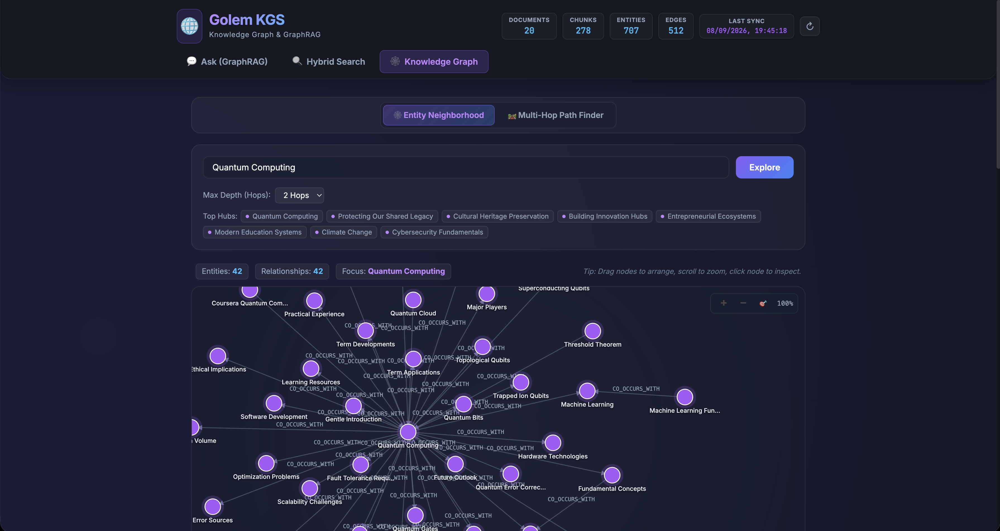
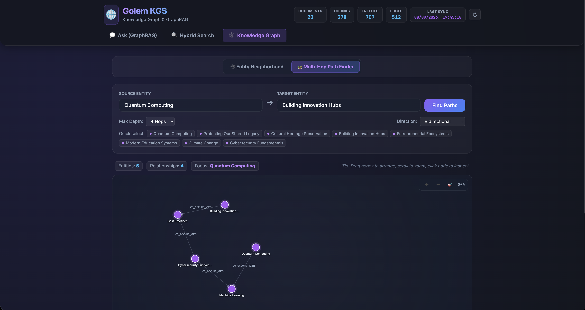
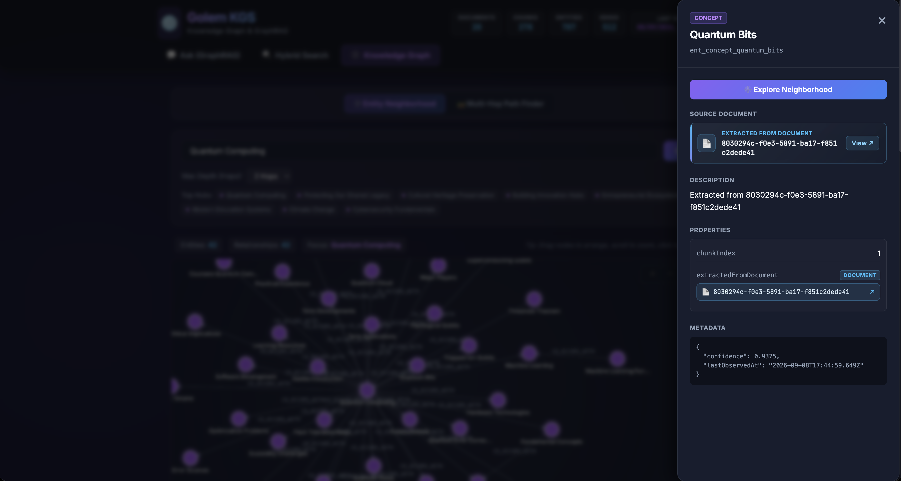
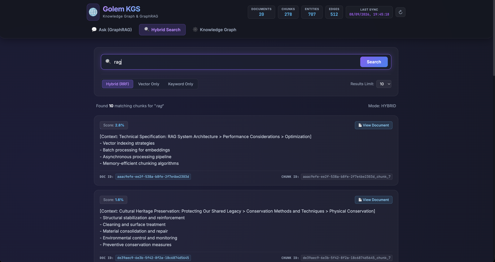
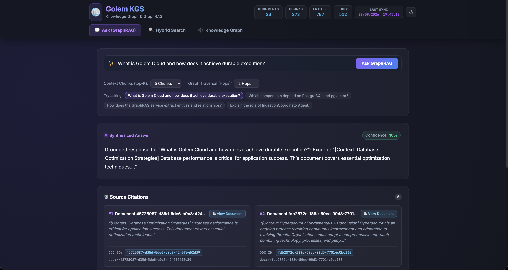
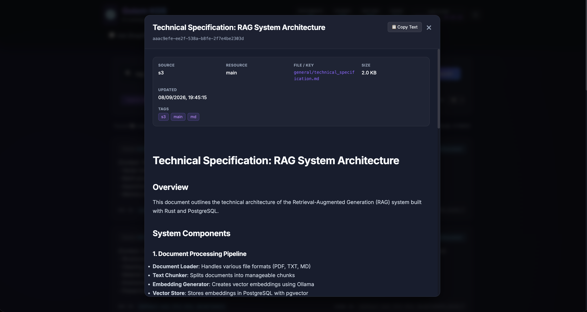

# Knowledge Graph & GraphRAG Explorer (Frontend)

An interactive visual web explorer for the **Golem Knowledge Graph Service**, built with [Vue 3](https://vuejs.org/) and [Vite](https://vitejs.dev/). It provides interactive force-directed graph exploration, multi-hop relational path finding, hybrid vector + keyword search, GraphRAG question-answering with citations, and document inspection.

---

## Features & Visual Walkthrough

### 1. Interactive Knowledge Graph Explorer

Explore canonical entities, cluster hubs, and directed relationships with a high-performance force-directed canvas. Supports entity search with autocomplete, top-degree hub discovery, and depth-configurable neighborhood expansion.



### 2. Multi-Hop Relational Path Finding

Discover shortest relational paths between any two entities in the knowledge graph. Highlights intermediate nodes, edge relation types, weights, and confidence scores across the traversal path.



### 3. Entity Detail Inspector & Provenance

Inspect entity metadata, properties, canonical names, alternative aliases, connected inbound/outbound relationships, and grounding source chunks.



### 4. Hybrid Search (Vector + Full-Text)

Search across ingested document chunks using dense 768-dimensional vector cosine similarity combined with PostgreSQL full-text search, fused using Reciprocal Rank Fusion (RRF, $k=60$).



### 5. GraphRAG Question Answering

Ask natural language questions answered by GraphRAG. The interface displays synthesized answers with cited sources, expandable context bundles, retrieved grounding chunks, and traversed graph entities/relationships.



### 6. Raw Document & Section Viewer

Inspect complete source Markdown documents, section heading breadcrumbs, metadata, and token statistics directly within a clean modal viewer.



---

## Getting Started

### Prerequisites

- **Node.js**: >= 20.x
- **Backend Service**: The Golem Knowledge Graph backend should be running and deployed on `http://localhost:9006` (see the root [README.md](../README.md)).

### 1. Install Dependencies

From the `frontend/` directory:

```bash
cd frontend
npm install
```

### 2. Run Development Server

Start the local development server with Hot Module Replacement (HMR):

```bash
npm run dev
```

The frontend will be available at:

👉 **[http://localhost:5173](http://localhost:5173)**

### 3. Build for Production

To create an optimized production bundle in `dist/`:

```bash
npm run build
```

To preview the production build locally:

```bash
npm run preview
```

---

## Architecture & Configuration

### Backend Proxy Configuration

The development server is preconfigured in [`vite.config.js`](./vite.config.js) to proxy all `/api/*` requests to the local Golem HTTP Gateway running on port `9006`:

```js
export default defineConfig({
  plugins: [vue()],
  server: {
    proxy: {
      "/api": {
        target: "http://localhost:9006",
        changeOrigin: true,
      },
    },
  },
});
```

If your Golem cluster or HTTP Gateway is running on a different port or host, update the `target` URL in `vite.config.js`.

### Technology Stack

| Technology                       | Purpose                                                              |
| :------------------------------- | :------------------------------------------------------------------- |
| **Vue 3** (`<script setup>` SFC) | Reactive UI components, state management, and views                  |
| **Vite**                         | Fast dev server, proxy routing, and production asset bundler         |
| **HTML5 Canvas Engine**          | Custom force-directed simulation for graph visualization             |
| **Marked**                       | Secure Markdown rendering for GraphRAG answers and document previews |

---

## Project Structure

```
frontend/
├── screenshots/             # Interface preview screenshots
│   ├── kn_graph.png         # Force-directed knowledge graph view
│   ├── kn_path.png          # Relational path finding view
│   ├── ent_detail.png       # Entity detail drawer
│   ├── hybrid_search.png    # Hybrid RRF search interface
│   ├── ask.png              # GraphRAG question-answering view
│   └── document_view.png    # Raw document modal viewer
├── src/
│   ├── components/
│   │   ├── GraphCanvas.vue   # Force-directed canvas simulation & controls
│   │   ├── EntityDrawer.vue  # Entity details, aliases & connections drawer
│   │   └── DocumentModal.vue # Source document & chunk inspector
│   ├── views/
│   │   ├── GraphView.vue     # Knowledge graph & path finding explorer
│   │   ├── SearchView.vue    # Hybrid vector + keyword search view
│   │   └── AskView.vue       # GraphRAG question answering view
│   ├── services/             # API client services calling /api/knowledge
│   ├── types/                # TypeScript interface definitions
│   ├── App.vue               # Main shell & navigation header
│   └── main.js               # Application entrypoint
├── package.json
├── vite.config.js            # Vite setup with /api proxy to Golem (:9006)
└── README.md
```
